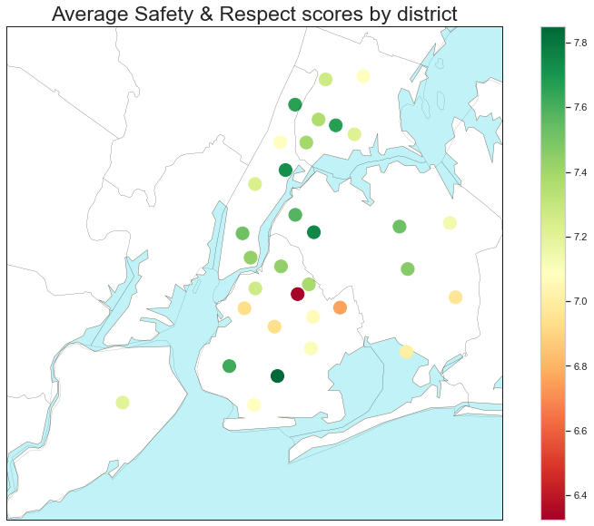
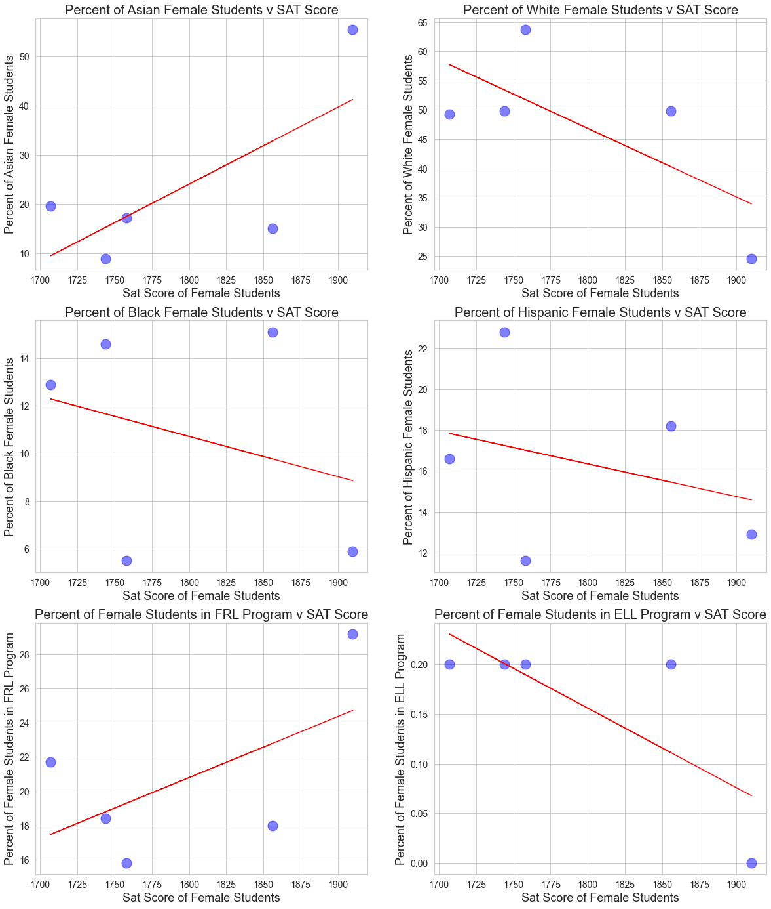

# Are SAT Scores a Fair Test for All Students?

### For this analysis, we will be using the New York City published data on student SAT scores by high school along with other demographic datasets to answer the following questions:

* <b>Which fields from the data have a high correlation with SAT scores?<br/>
<br/>
* For those fields with high correlation with SAT scores: are their other patterns we can find as we deep dive into those correlations?<br/>
<br/>
* Does race, economic wellfare, district, or any other demographic play a role in SAT scores?</b>

### In our analysis we will be using a combined pandas dataframe that includes the following datasets:

* <b>SAT scores by school</b> - SAT scores for each high school in New York City
* <b>School attendance</b> - Attendance information for each school in New York City
* <b>Class size</b> - Information on class size for each school
* <b>AP test results</b> - Advanced Placement (AP) exam results for each high school (passing an optional AP exam in a particular subject can earn a student college credit in that subject)
* <b>Graduation outcomes</b> - The percentage of students who graduated, and other outcome information
* <b>Demographics</b> - Demographic information for each school
* <b>School survey</b> - Surveys of parents, teachers, and students at each school

## Summary of Final Analysis/Conclusion of Student Demographics/Survey Catagories vs. SAT Scores:

+ There is a clear negative relationship between ELL, FRL, Black, and Hispanic students and the SAT scores.
+ On average, Asian and White students have an advantage over Black and Hispanic students when it comes to SAT scores in NYC.
+ Schools with the highest SAT scores are ones with between 40-75% female student body, or between 30-70% male student body
+ Both ELL and race (namely Asian and Hispanic) play a role in average SAT scores for schools.
+ While ELL overall negatively correlates with SAT, Asian ELL students tend to do better on average than Hispanic ELL students on the SATs.

It's important to note that this study does not have enough data available to be able to drill down further on why race plays a role in the SATs, only that it does. This is not an indication that any race is more or less intelligent than another, it is merely an observational data point and there can be many contributing factors in the reasons behind these differences. In order to further study this, we would need to look into students' enviromental and cultural differences, neighborhoods, parents' education, family income, student employment, etc.

## Reading in the data


```python
# Importing all necessary language dictionaries
import pandas as pd
import numpy as np
import re
import matplotlib
import matplotlib.pyplot as plt
%matplotlib inline
import seaborn as sns
import geopandas as gpd
from shapely import wkt
import geopy
import matplotlib.cm
from mpl_toolkits.basemap import Basemap
```


```python
# Importing all the data files and combining them into 1
data_files = [
    "ap_2010.csv",
    "class_size.csv",
    "demographics.csv",
    "graduation.csv",
    "hs_directory.csv",
    "sat_results.csv"
]
# Removing '.csv' and formatting all files
data = {}

for f in data_files:
    d = pd.read_csv("schools/{0}".format(f))
    data[f.replace(".csv", "")] = d
```

## Reading in the surveys


```python
# Reading in the survey data, using tab spaced format, and encoding so it is readable
# Concatenating 'all_survey' and 'd75_survey'
all_survey = pd.read_csv("schools/survey_all.txt", delimiter="\t", encoding='windows-1252')
d75_survey = pd.read_csv("schools/survey_d75.txt", delimiter="\t", encoding='windows-1252')
survey = pd.concat([all_survey, d75_survey], axis=0)

# Updating the'dbn' field to capital letters
survey["DBN"] = survey["dbn"]
# Listing the survey fields in a variable
survey_fields = [
    "DBN", 
     "rr_s", 
    "rr_t", 
    "rr_p", 
    "N_s", 
    "N_t", 
    "N_p", 
    "saf_p_11", 
    "com_p_11", 
    "eng_p_11", 
    "aca_p_11", 
    "saf_t_11", 
    "com_t_11", 
    "eng_t_11", 
    "aca_t_11", 
    "saf_s_11", 
    "com_s_11", 
    "eng_s_11", 
    "aca_s_11", 
    "saf_tot_11", 
    "com_tot_11", 
    "eng_tot_11", 
    "aca_tot_11",
]

# Creating a DataFrame called 'survey' with all survey fields as columns 
survey = survey.loc[:,survey_fields]
data["survey"] = survey

# Updating the column names in survey for readability
col_names = {'rr_s': 'Student Response Rate', 'rr_t': 'Teacher Response Rate', 'rr_p': 'Parent Response Rate', 
             'N_s': 'Number of Students', 'N_t': 'Number of Teachers', 'N_p': 'Number of Parents', 'saf_p_11': 'Parent Safety Rating', 
             'com_p_11': 'Parent Communication Rating', 'eng_p_11': 'Parent Engagement Rating', 'aca_p_11': 'Parent Academia Rating', 
             'saf_t_11': 'Teacher Safety Rating', 'com_t_11': 'Teacher Communication Rating','eng_t_11': 'Teacher Engagement Rating', 
             'aca_t_11': 'Teacher Academia Rating', 'saf_s_11': 'Student Safety Rating', 'com_s_11': 'Student Communication Rating',
             'eng_s_11': 'Student Engagement Rating', 'aca_s_11': 'Student Academia Rating', 'saf_tot_11': 'Total Safety Rating', 
             'com_tot_11': 'Total Communication Rating', 'eng_tot_11': 'Total Engagement Rating', 'aca_tot_11': 'Total Academia Rating'}
survey.rename(columns = col_names)
survey.head(3)
```


<div>
<style scoped>
    .dataframe tbody tr th:only-of-type {
        vertical-align: middle;
    }

    .dataframe tbody tr th {
        vertical-align: top;
    }

    .dataframe thead th {
        text-align: right;
    }
</style>
<table border="1" class="dataframe">
  <thead>
    <tr style="text-align: right;">
      <th></th>
      <th>DBN</th>
      <th>rr_s</th>
      <th>rr_t</th>
      <th>rr_p</th>
      <th>N_s</th>
      <th>N_t</th>
      <th>N_p</th>
      <th>saf_p_11</th>
      <th>com_p_11</th>
      <th>eng_p_11</th>
      <th>...</th>
      <th>eng_t_11</th>
      <th>aca_t_11</th>
      <th>saf_s_11</th>
      <th>com_s_11</th>
      <th>eng_s_11</th>
      <th>aca_s_11</th>
      <th>saf_tot_11</th>
      <th>com_tot_11</th>
      <th>eng_tot_11</th>
      <th>aca_tot_11</th>
    </tr>
  </thead>
  <tbody>
    <tr>
      <th>0</th>
      <td>01M015</td>
      <td>NaN</td>
      <td>88</td>
      <td>60</td>
      <td>NaN</td>
      <td>22.0</td>
      <td>90.0</td>
      <td>8.5</td>
      <td>7.6</td>
      <td>7.5</td>
      <td>...</td>
      <td>7.6</td>
      <td>7.9</td>
      <td>NaN</td>
      <td>NaN</td>
      <td>NaN</td>
      <td>NaN</td>
      <td>8.0</td>
      <td>7.7</td>
      <td>7.5</td>
      <td>7.9</td>
    </tr>
    <tr>
      <th>1</th>
      <td>01M019</td>
      <td>NaN</td>
      <td>100</td>
      <td>60</td>
      <td>NaN</td>
      <td>34.0</td>
      <td>161.0</td>
      <td>8.4</td>
      <td>7.6</td>
      <td>7.6</td>
      <td>...</td>
      <td>8.9</td>
      <td>9.1</td>
      <td>NaN</td>
      <td>NaN</td>
      <td>NaN</td>
      <td>NaN</td>
      <td>8.5</td>
      <td>8.1</td>
      <td>8.2</td>
      <td>8.4</td>
    </tr>
    <tr>
      <th>2</th>
      <td>01M020</td>
      <td>NaN</td>
      <td>88</td>
      <td>73</td>
      <td>NaN</td>
      <td>42.0</td>
      <td>367.0</td>
      <td>8.9</td>
      <td>8.3</td>
      <td>8.3</td>
      <td>...</td>
      <td>6.8</td>
      <td>7.5</td>
      <td>NaN</td>
      <td>NaN</td>
      <td>NaN</td>
      <td>NaN</td>
      <td>8.2</td>
      <td>7.3</td>
      <td>7.5</td>
      <td>8.0</td>
    </tr>
  </tbody>
</table>
<p>3 rows × 23 columns</p>
</div>


## Updating 'dbn' to 'DBN' (Database Numbers) column


```python
# Capitalizing 'dbn' column name
data["hs_directory"]["DBN"] = data["hs_directory"]["dbn"]

# Changing 'CSD' to 'padded_csd'
def pad_csd(num):
    string_representation = str(num)
    if len(string_representation) > 1:
        return string_representation
    else:
        return "0" + string_representation
    
data["class_size"]["padded_csd"] = data["class_size"]["CSD"].apply(pad_csd)
data["class_size"]["DBN"] = data["class_size"]["padded_csd"] + data["class_size"]["SCHOOL CODE"]
```

## Converting columns to numeric


```python
# Converting SAT results to numeric
cols = ['SAT Math Avg. Score', 'SAT Critical Reading Avg. Score', 'SAT Writing Avg. Score']
for c in cols:
    data["sat_results"][c] = pd.to_numeric(data["sat_results"][c], errors="coerce")

data['sat_results']['sat_score'] = data['sat_results'][cols[0]] + data['sat_results'][cols[1]] + data['sat_results'][cols[2]]

# Adding coordinates of schools to locate their districts
def find_lat(loc):
    coords = re.findall("\(.+, .+\)", loc)
    lat = coords[0].split(",")[0].replace("(", "")
    return lat

def find_lon(loc):
    coords = re.findall("\(.+, .+\)", loc)
    lon = coords[0].split(",")[1].replace(")", "").strip()
    return lon

data["hs_directory"]["lat"] = data["hs_directory"]["Location 1"].apply(find_lat)
data["hs_directory"]["lon"] = data["hs_directory"]["Location 1"].apply(find_lon)
data["hs_directory"]["lat"] = pd.to_numeric(data["hs_directory"]["lat"], errors="coerce")
data["hs_directory"]["lon"] = pd.to_numeric(data["hs_directory"]["lon"], errors="coerce")
```

## Condensing datasets


```python
# Condensing dataset 'class_size' and only including high school grades '09-12' in 'GEN ED'
class_size = data["class_size"]
class_size = class_size[class_size["GRADE "] == "09-12"]
class_size = class_size[class_size["PROGRAM TYPE"] == "GEN ED"]

# Converting 'class_size' to a mean grouped by 'DBN'
class_size = class_size.groupby("DBN").agg(np.mean)
class_size.reset_index(inplace=True)
data["class_size"] = class_size

# Only including demographics from school years 2011 and 2012
data["demographics"] = data["demographics"][data["demographics"]["schoolyear"] == 20112012]

# Filtering for 'graduation' on 'Cohort' of 2006 and 'Demographic' of 'Total Cohort'
data["graduation"] = data["graduation"][data["graduation"]["Cohort"] == "2006"]
data["graduation"] = data["graduation"][data["graduation"]["Demographic"] == "Total Cohort"]
```

## Converting AP scores to numeric


```python
# Converting AP columns to numeric
cols = ['AP Test Takers ', 'Total Exams Taken', 'Number of Exams with scores 3 4 or 5']

for col in cols:
    data["ap_2010"][col] = pd.to_numeric(data["ap_2010"][col], errors="coerce")
```

## Combining the datasets


```python
# Merging the datasets into a DataFrame called 'combined'
combined = data["sat_results"]
combined = combined.merge(data["ap_2010"], on="DBN", how="left")
combined = combined.merge(data["graduation"], on="DBN", how="left")
to_merge = ["class_size", "demographics", "survey", "hs_directory"]

for m in to_merge:
    combined = combined.merge(data[m], on="DBN", how="inner")
    
combined = combined.fillna(combined.mean())
combined = combined.fillna(0)
```


```python
pd.options.display.max_columns = None
display(combined.head(3))
```


<div>
<style scoped>
    .dataframe tbody tr th:only-of-type {
        vertical-align: middle;
    }

    .dataframe tbody tr th {
        vertical-align: top;
    }

    .dataframe thead th {
        text-align: right;
    }
</style>
<table border="1" class="dataframe">
  <thead>
    <tr style="text-align: right;">
      <th></th>
      <th>DBN</th>
      <th>SCHOOL NAME</th>
      <th>Num of SAT Test Takers</th>
      <th>SAT Critical Reading Avg. Score</th>
      <th>SAT Math Avg. Score</th>
      <th>SAT Writing Avg. Score</th>
      <th>sat_score</th>
      <th>SchoolName</th>
      <th>AP Test Takers</th>
      <th>Total Exams Taken</th>
      <th>Number of Exams with scores 3 4 or 5</th>
      <th>Demographic</th>
      <th>School Name</th>
      <th>Cohort</th>
      <th>Total Cohort</th>
      <th>Total Grads - n</th>
      <th>Total Grads - % of cohort</th>
      <th>Total Regents - n</th>
      <th>Total Regents - % of cohort</th>
      <th>Total Regents - % of grads</th>
      <th>Advanced Regents - n</th>
      <th>Advanced Regents - % of cohort</th>
      <th>Advanced Regents - % of grads</th>
      <th>Regents w/o Advanced - n</th>
      <th>Regents w/o Advanced - % of cohort</th>
      <th>Regents w/o Advanced - % of grads</th>
      <th>Local - n</th>
      <th>Local - % of cohort</th>
      <th>Local - % of grads</th>
      <th>Still Enrolled - n</th>
      <th>Still Enrolled - % of cohort</th>
      <th>Dropped Out - n</th>
      <th>Dropped Out - % of cohort</th>
      <th>CSD</th>
      <th>NUMBER OF STUDENTS / SEATS FILLED</th>
      <th>NUMBER OF SECTIONS</th>
      <th>AVERAGE CLASS SIZE</th>
      <th>SIZE OF SMALLEST CLASS</th>
      <th>SIZE OF LARGEST CLASS</th>
      <th>SCHOOLWIDE PUPIL-TEACHER RATIO</th>
      <th>Name</th>
      <th>schoolyear</th>
      <th>fl_percent</th>
      <th>frl_percent</th>
      <th>total_enrollment</th>
      <th>prek</th>
      <th>k</th>
      <th>grade1</th>
      <th>grade2</th>
      <th>grade3</th>
      <th>grade4</th>
      <th>grade5</th>
      <th>grade6</th>
      <th>grade7</th>
      <th>grade8</th>
      <th>grade9</th>
      <th>grade10</th>
      <th>grade11</th>
      <th>grade12</th>
      <th>ell_num</th>
      <th>ell_percent</th>
      <th>sped_num</th>
      <th>sped_percent</th>
      <th>ctt_num</th>
      <th>selfcontained_num</th>
      <th>asian_num</th>
      <th>asian_per</th>
      <th>black_num</th>
      <th>black_per</th>
      <th>hispanic_num</th>
      <th>hispanic_per</th>
      <th>white_num</th>
      <th>white_per</th>
      <th>male_num</th>
      <th>male_per</th>
      <th>female_num</th>
      <th>female_per</th>
      <th>rr_s</th>
      <th>rr_t</th>
      <th>rr_p</th>
      <th>N_s</th>
      <th>N_t</th>
      <th>N_p</th>
      <th>saf_p_11</th>
      <th>com_p_11</th>
      <th>eng_p_11</th>
      <th>aca_p_11</th>
      <th>saf_t_11</th>
      <th>com_t_11</th>
      <th>eng_t_11</th>
      <th>aca_t_11</th>
      <th>saf_s_11</th>
      <th>com_s_11</th>
      <th>eng_s_11</th>
      <th>aca_s_11</th>
      <th>saf_tot_11</th>
      <th>com_tot_11</th>
      <th>eng_tot_11</th>
      <th>aca_tot_11</th>
      <th>dbn</th>
      <th>school_name</th>
      <th>borough</th>
      <th>building_code</th>
      <th>phone_number</th>
      <th>fax_number</th>
      <th>grade_span_min</th>
      <th>grade_span_max</th>
      <th>expgrade_span_min</th>
      <th>expgrade_span_max</th>
      <th>bus</th>
      <th>subway</th>
      <th>primary_address_line_1</th>
      <th>city</th>
      <th>state_code</th>
      <th>postcode</th>
      <th>website</th>
      <th>total_students</th>
      <th>campus_name</th>
      <th>school_type</th>
      <th>overview_paragraph</th>
      <th>program_highlights</th>
      <th>language_classes</th>
      <th>advancedplacement_courses</th>
      <th>online_ap_courses</th>
      <th>online_language_courses</th>
      <th>extracurricular_activities</th>
      <th>psal_sports_boys</th>
      <th>psal_sports_girls</th>
      <th>psal_sports_coed</th>
      <th>school_sports</th>
      <th>partner_cbo</th>
      <th>partner_hospital</th>
      <th>partner_highered</th>
      <th>partner_cultural</th>
      <th>partner_nonprofit</th>
      <th>partner_corporate</th>
      <th>partner_financial</th>
      <th>partner_other</th>
      <th>addtl_info1</th>
      <th>addtl_info2</th>
      <th>start_time</th>
      <th>end_time</th>
      <th>se_services</th>
      <th>ell_programs</th>
      <th>school_accessibility_description</th>
      <th>number_programs</th>
      <th>priority01</th>
      <th>priority02</th>
      <th>priority03</th>
      <th>priority04</th>
      <th>priority05</th>
      <th>priority06</th>
      <th>priority07</th>
      <th>priority08</th>
      <th>priority09</th>
      <th>priority10</th>
      <th>Location 1</th>
      <th>Community Board</th>
      <th>Council District</th>
      <th>Census Tract</th>
      <th>BIN</th>
      <th>BBL</th>
      <th>NTA</th>
      <th>lat</th>
      <th>lon</th>
    </tr>
  </thead>
  <tbody>
    <tr>
      <th>0</th>
      <td>01M292</td>
      <td>HENRY STREET SCHOOL FOR INTERNATIONAL STUDIES</td>
      <td>29</td>
      <td>355.0</td>
      <td>404.0</td>
      <td>363.0</td>
      <td>1122.0</td>
      <td>0</td>
      <td>129.028846</td>
      <td>197.038462</td>
      <td>153.45</td>
      <td>Total Cohort</td>
      <td>HENRY STREET SCHOOL FOR INTERNATIONAL</td>
      <td>2006</td>
      <td>78.0</td>
      <td>43</td>
      <td>55.1</td>
      <td>36</td>
      <td>46.2</td>
      <td>83.7</td>
      <td>0</td>
      <td>0.0</td>
      <td>0.0</td>
      <td>36</td>
      <td>46.2</td>
      <td>83.7</td>
      <td>7</td>
      <td>9.0</td>
      <td>16.3</td>
      <td>16</td>
      <td>20.5</td>
      <td>11</td>
      <td>14.1</td>
      <td>1</td>
      <td>88.0000</td>
      <td>4.000000</td>
      <td>22.564286</td>
      <td>18.50</td>
      <td>26.571429</td>
      <td>0.0</td>
      <td>HENRY STREET SCHOOL FOR INTERNATIONAL STUDIES</td>
      <td>20112012</td>
      <td>0.0</td>
      <td>88.6</td>
      <td>422</td>
      <td></td>
      <td></td>
      <td></td>
      <td></td>
      <td></td>
      <td></td>
      <td></td>
      <td>32</td>
      <td>33</td>
      <td>50</td>
      <td>98</td>
      <td>79</td>
      <td>80</td>
      <td>50</td>
      <td>94.0</td>
      <td>22.3</td>
      <td>105.0</td>
      <td>24.9</td>
      <td>34</td>
      <td>35</td>
      <td>59</td>
      <td>14.0</td>
      <td>123</td>
      <td>29.1</td>
      <td>227</td>
      <td>53.8</td>
      <td>7</td>
      <td>1.7</td>
      <td>259.0</td>
      <td>61.4</td>
      <td>163.0</td>
      <td>38.6</td>
      <td>89.0</td>
      <td>70</td>
      <td>39</td>
      <td>379.000000</td>
      <td>26.0</td>
      <td>151.0</td>
      <td>7.8</td>
      <td>7.7</td>
      <td>7.4</td>
      <td>7.6</td>
      <td>6.3</td>
      <td>5.3</td>
      <td>6.1</td>
      <td>6.5</td>
      <td>6.000000</td>
      <td>5.600000</td>
      <td>6.100000</td>
      <td>6.700000</td>
      <td>6.7</td>
      <td>6.2</td>
      <td>6.6</td>
      <td>7.0</td>
      <td>01M292</td>
      <td>Henry Street School for International Studies</td>
      <td>Manhattan</td>
      <td>M056</td>
      <td>212-406-9411</td>
      <td>212-406-9417</td>
      <td>6.0</td>
      <td>12</td>
      <td>0.0</td>
      <td>12.0</td>
      <td>B39, M14A, M14D, M15, M15-SBS, M21, M22, M9</td>
      <td>B, D to Grand St ; F to East Broadway ; J, M, ...</td>
      <td>220 Henry Street</td>
      <td>New York</td>
      <td>NY</td>
      <td>10002</td>
      <td>http://schools.nyc.gov/schoolportals/01/M292</td>
      <td>323.0</td>
      <td>0</td>
      <td>0</td>
      <td>Henry Street School for International Studies ...</td>
      <td>Global/International Studies in core subjects,...</td>
      <td>Chinese (Mandarin), Spanish</td>
      <td>Psychology</td>
      <td>Chinese Language and Culture, Spanish Literatu...</td>
      <td>Chinese (Mandarin), Spanish</td>
      <td>Math through Card Play; Art, Poetry/Spoken Wor...</td>
      <td>Softball</td>
      <td>Softball</td>
      <td>Soccer</td>
      <td>Boxing, Track, CHAMPS, Tennis, Flag Football, ...</td>
      <td>The Henry Street Settlement; Asia Society; Ame...</td>
      <td>Gouverneur Hospital (Turning Points)</td>
      <td>New York University</td>
      <td>Asia Society</td>
      <td>Heart of America Foundation</td>
      <td>0</td>
      <td>0</td>
      <td>United Nations</td>
      <td>0</td>
      <td>0</td>
      <td>8:30 AM</td>
      <td>3:30 PM</td>
      <td>This school will provide students with disabil...</td>
      <td>ESL</td>
      <td>Functionally Accessible</td>
      <td>1</td>
      <td>Priority to continuing 8th graders</td>
      <td>Then to Manhattan students or residents who at...</td>
      <td>Then to New York City residents who attend an ...</td>
      <td>Then to Manhattan students or residents</td>
      <td>Then to New York City residents</td>
      <td>0</td>
      <td>0</td>
      <td>0.0</td>
      <td>0.0</td>
      <td>0.0</td>
      <td>220 Henry Street\nNew York, NY 10002\n(40.7137...</td>
      <td>3.0</td>
      <td>1.0</td>
      <td>201.0</td>
      <td>1003223.0</td>
      <td>1.002690e+09</td>
      <td>Lower East Side                               ...</td>
      <td>40.713764</td>
      <td>-73.985260</td>
    </tr>
    <tr>
      <th>1</th>
      <td>01M448</td>
      <td>UNIVERSITY NEIGHBORHOOD HIGH SCHOOL</td>
      <td>91</td>
      <td>383.0</td>
      <td>423.0</td>
      <td>366.0</td>
      <td>1172.0</td>
      <td>UNIVERSITY NEIGHBORHOOD H.S.</td>
      <td>39.000000</td>
      <td>49.000000</td>
      <td>10.00</td>
      <td>Total Cohort</td>
      <td>UNIVERSITY NEIGHBORHOOD HIGH SCHOOL</td>
      <td>2006</td>
      <td>124.0</td>
      <td>53</td>
      <td>42.7</td>
      <td>42</td>
      <td>33.9</td>
      <td>79.2</td>
      <td>8</td>
      <td>6.5</td>
      <td>15.1</td>
      <td>34</td>
      <td>27.4</td>
      <td>64.2</td>
      <td>11</td>
      <td>8.9</td>
      <td>20.8</td>
      <td>46</td>
      <td>37.1</td>
      <td>20</td>
      <td>16.1</td>
      <td>1</td>
      <td>105.6875</td>
      <td>4.750000</td>
      <td>22.231250</td>
      <td>18.25</td>
      <td>27.062500</td>
      <td>0.0</td>
      <td>UNIVERSITY NEIGHBORHOOD HIGH SCHOOL</td>
      <td>20112012</td>
      <td>0.0</td>
      <td>71.8</td>
      <td>394</td>
      <td></td>
      <td></td>
      <td></td>
      <td></td>
      <td></td>
      <td></td>
      <td></td>
      <td></td>
      <td></td>
      <td></td>
      <td>109</td>
      <td>97</td>
      <td>93</td>
      <td>95</td>
      <td>83.0</td>
      <td>21.1</td>
      <td>86.0</td>
      <td>21.8</td>
      <td>55</td>
      <td>10</td>
      <td>115</td>
      <td>29.2</td>
      <td>89</td>
      <td>22.6</td>
      <td>181</td>
      <td>45.9</td>
      <td>9</td>
      <td>2.3</td>
      <td>226.0</td>
      <td>57.4</td>
      <td>168.0</td>
      <td>42.6</td>
      <td>84.0</td>
      <td>95</td>
      <td>10</td>
      <td>385.000000</td>
      <td>37.0</td>
      <td>46.0</td>
      <td>7.9</td>
      <td>7.4</td>
      <td>7.2</td>
      <td>7.3</td>
      <td>6.6</td>
      <td>5.8</td>
      <td>6.6</td>
      <td>7.3</td>
      <td>6.000000</td>
      <td>5.700000</td>
      <td>6.300000</td>
      <td>7.000000</td>
      <td>6.8</td>
      <td>6.3</td>
      <td>6.7</td>
      <td>7.2</td>
      <td>01M448</td>
      <td>University Neighborhood High School</td>
      <td>Manhattan</td>
      <td>M446</td>
      <td>212-962-4341</td>
      <td>212-267-5611</td>
      <td>9.0</td>
      <td>12</td>
      <td>0.0</td>
      <td>12.0</td>
      <td>M14A, M14D, M15, M21, M22, M9</td>
      <td>F to East Broadway ; J, M, Z to Delancey St-Es...</td>
      <td>200 Monroe Street</td>
      <td>New York</td>
      <td>NY</td>
      <td>10002</td>
      <td>www.universityneighborhoodhs.com</td>
      <td>299.0</td>
      <td>0</td>
      <td>0</td>
      <td>University Neighborhood High School (UNHS) is ...</td>
      <td>While attending UNHS, students can earn up to ...</td>
      <td>Chinese, Spanish</td>
      <td>Calculus AB, Chinese Language and Culture, Eng...</td>
      <td>0</td>
      <td>Chinese (Cantonese), Chinese (Mandarin), Spanish</td>
      <td>Basketball, Badminton, Handball, Glee, Dance, ...</td>
      <td>Basketball, Bowling, Cross Country, Softball, ...</td>
      <td>Basketball, Bowling, Cross Country, Softball, ...</td>
      <td>0</td>
      <td>0</td>
      <td>Grand Street Settlement, Henry Street Settleme...</td>
      <td>Gouverneur Hospital, The Door, The Mount Sinai...</td>
      <td>New York University, CUNY Baruch College, Pars...</td>
      <td>Dance Film Association, Dance Makers Film Work...</td>
      <td>W!SE, Big Brothers Big Sisters, Peer Health Ex...</td>
      <td>Deloitte LLP Consulting and Financial Services...</td>
      <td>0</td>
      <td>Movement Research</td>
      <td>Incoming students are expected to attend schoo...</td>
      <td>Community Service Requirement, Dress Code Requ...</td>
      <td>8:15 AM</td>
      <td>3:15 PM</td>
      <td>This school will provide students with disabil...</td>
      <td>ESL</td>
      <td>Not Functionally Accessible</td>
      <td>3</td>
      <td>Open to New York City residents</td>
      <td>For M35B only: Open only to students whose hom...</td>
      <td>0</td>
      <td>0</td>
      <td>0</td>
      <td>0</td>
      <td>0</td>
      <td>0.0</td>
      <td>0.0</td>
      <td>0.0</td>
      <td>200 Monroe Street\nNew York, NY 10002\n(40.712...</td>
      <td>3.0</td>
      <td>1.0</td>
      <td>202.0</td>
      <td>1003214.0</td>
      <td>1.002590e+09</td>
      <td>Lower East Side                               ...</td>
      <td>40.712332</td>
      <td>-73.984797</td>
    </tr>
    <tr>
      <th>2</th>
      <td>01M450</td>
      <td>EAST SIDE COMMUNITY SCHOOL</td>
      <td>70</td>
      <td>377.0</td>
      <td>402.0</td>
      <td>370.0</td>
      <td>1149.0</td>
      <td>EAST SIDE COMMUNITY HS</td>
      <td>19.000000</td>
      <td>21.000000</td>
      <td>153.45</td>
      <td>Total Cohort</td>
      <td>EAST SIDE COMMUNITY SCHOOL</td>
      <td>2006</td>
      <td>90.0</td>
      <td>70</td>
      <td>77.8</td>
      <td>67</td>
      <td>74.4</td>
      <td>95.7</td>
      <td>0</td>
      <td>0.0</td>
      <td>0.0</td>
      <td>67</td>
      <td>74.4</td>
      <td>95.7</td>
      <td>3</td>
      <td>3.3</td>
      <td>4.3</td>
      <td>15</td>
      <td>16.7</td>
      <td>5</td>
      <td>5.6</td>
      <td>1</td>
      <td>57.6000</td>
      <td>2.733333</td>
      <td>21.200000</td>
      <td>19.40</td>
      <td>22.866667</td>
      <td>0.0</td>
      <td>EAST SIDE COMMUNITY HIGH SCHOOL</td>
      <td>20112012</td>
      <td>0.0</td>
      <td>71.8</td>
      <td>598</td>
      <td></td>
      <td></td>
      <td></td>
      <td></td>
      <td></td>
      <td></td>
      <td></td>
      <td>92</td>
      <td>73</td>
      <td>76</td>
      <td>101</td>
      <td>93</td>
      <td>77</td>
      <td>86</td>
      <td>30.0</td>
      <td>5.0</td>
      <td>158.0</td>
      <td>26.4</td>
      <td>91</td>
      <td>19</td>
      <td>58</td>
      <td>9.7</td>
      <td>143</td>
      <td>23.9</td>
      <td>331</td>
      <td>55.4</td>
      <td>62</td>
      <td>10.4</td>
      <td>327.0</td>
      <td>54.7</td>
      <td>271.0</td>
      <td>45.3</td>
      <td>0.0</td>
      <td>98</td>
      <td>28</td>
      <td>598.208333</td>
      <td>42.0</td>
      <td>150.0</td>
      <td>8.7</td>
      <td>8.2</td>
      <td>8.1</td>
      <td>8.4</td>
      <td>7.3</td>
      <td>8.0</td>
      <td>8.0</td>
      <td>8.8</td>
      <td>6.611667</td>
      <td>6.094722</td>
      <td>6.620278</td>
      <td>7.381389</td>
      <td>7.9</td>
      <td>7.9</td>
      <td>7.9</td>
      <td>8.4</td>
      <td>01M450</td>
      <td>East Side Community School</td>
      <td>Manhattan</td>
      <td>M060</td>
      <td>212-460-8467</td>
      <td>212-260-9657</td>
      <td>6.0</td>
      <td>12</td>
      <td>0.0</td>
      <td>12.0</td>
      <td>M101, M102, M103, M14A, M14D, M15, M15-SBS, M2...</td>
      <td>6 to Astor Place ; L to 1st Ave</td>
      <td>420 East 12 Street</td>
      <td>New York</td>
      <td>NY</td>
      <td>10009</td>
      <td>www.eschs.org</td>
      <td>649.0</td>
      <td>0</td>
      <td>Consortium School</td>
      <td>We are a small 6-12 secondary school that prep...</td>
      <td>Our Advisory System ensures that we can effect...</td>
      <td>0</td>
      <td>Calculus AB, English Literature and Composition</td>
      <td>0</td>
      <td>American Sign Language, Arabic, Chinese (Manda...</td>
      <td>After-School Tutoring, Art Portfolio Classes, ...</td>
      <td>Basketball, Soccer, Softball</td>
      <td>Basketball, Soccer, Softball</td>
      <td>0</td>
      <td>Basketball, Bicycling, Fitness, Flag Football,...</td>
      <td>University Settlement, Big Brothers Big Sister...</td>
      <td>0</td>
      <td>Columbia Teachers College, New York University...</td>
      <td>, Internship Program, Loisaida Art Gallery loc...</td>
      <td>College Bound Initiative, Center for Collabora...</td>
      <td>Prudential Securities, Moore Capital, Morgan S...</td>
      <td>0</td>
      <td>Brooklyn Boulders (Rock Climbing)</td>
      <td>Students present and defend their work to comm...</td>
      <td>Our school requires an Academic Portfolio for ...</td>
      <td>8:30 AM</td>
      <td>3:30 PM</td>
      <td>This school will provide students with disabil...</td>
      <td>ESL</td>
      <td>Not Functionally Accessible</td>
      <td>1</td>
      <td>Priority to continuing 8th graders</td>
      <td>Then to New York City residents</td>
      <td>0</td>
      <td>0</td>
      <td>0</td>
      <td>0</td>
      <td>0</td>
      <td>0.0</td>
      <td>0.0</td>
      <td>0.0</td>
      <td>420 East 12 Street\nNew York, NY 10009\n(40.72...</td>
      <td>3.0</td>
      <td>2.0</td>
      <td>34.0</td>
      <td>1005974.0</td>
      <td>1.004390e+09</td>
      <td>East Village                                  ...</td>
      <td>40.729783</td>
      <td>-73.983041</td>
    </tr>
  </tbody>
</table>
</div>


```python
combined.drop(['SchoolName', 'School Name'], inplace=True, axis=1)
```

## Adding a school district column for mapping


```python
# Using the first 2 characters in the DBN to create a column for districts
def get_first_two_chars(dbn):
    return dbn[0:2]

combined["school_dist"] = combined["DBN"].apply(get_first_two_chars)
```

## Finding correlations


```python
# Calculating all correlations with SAT scores
correlations = combined.corr()["sat_score"]
```

## Plotting survey correlations


```python
# Removing DBN since it's a unique identifier, not a useful numerical value for correlation.
survey_fields.remove("DBN")
```


```python
# Printing all columns with high correlation of more than 0.5 or less than -0.5
high_corr = {}
for index, value in correlations.items():
    if value >= 0.5 or value <= -0.5:
        high_corr[index] = value
        
high_corr
high_corr_df = pd.DataFrame(high_corr.items())
high_corr_df
```


<div>
<style scoped>
    .dataframe tbody tr th:only-of-type {
        vertical-align: middle;
    }

    .dataframe tbody tr th {
        vertical-align: top;
    }

    .dataframe thead th {
        text-align: right;
    }
</style>
<table border="1" class="dataframe">
  <thead>
    <tr style="text-align: right;">
      <th></th>
      <th>0</th>
      <th>1</th>
    </tr>
  </thead>
  <tbody>
    <tr>
      <th>0</th>
      <td>SAT Critical Reading Avg. Score</td>
      <td>0.986820</td>
    </tr>
    <tr>
      <th>1</th>
      <td>SAT Math Avg. Score</td>
      <td>0.972643</td>
    </tr>
    <tr>
      <th>2</th>
      <td>SAT Writing Avg. Score</td>
      <td>0.987771</td>
    </tr>
    <tr>
      <th>3</th>
      <td>sat_score</td>
      <td>1.000000</td>
    </tr>
    <tr>
      <th>4</th>
      <td>AP Test Takers</td>
      <td>0.523140</td>
    </tr>
    <tr>
      <th>5</th>
      <td>Total Exams Taken</td>
      <td>0.514333</td>
    </tr>
    <tr>
      <th>6</th>
      <td>Total Grads - % of cohort</td>
      <td>0.584234</td>
    </tr>
    <tr>
      <th>7</th>
      <td>Total Regents - % of cohort</td>
      <td>0.667603</td>
    </tr>
    <tr>
      <th>8</th>
      <td>Advanced Regents - % of cohort</td>
      <td>0.771566</td>
    </tr>
    <tr>
      <th>9</th>
      <td>Advanced Regents - % of grads</td>
      <td>0.739927</td>
    </tr>
    <tr>
      <th>10</th>
      <td>frl_percent</td>
      <td>-0.722225</td>
    </tr>
    <tr>
      <th>11</th>
      <td>asian_per</td>
      <td>0.570730</td>
    </tr>
    <tr>
      <th>12</th>
      <td>white_per</td>
      <td>0.620718</td>
    </tr>
  </tbody>
</table>
</div>


```python
#Defining a bar graph so we can use to display correlations with many fields
def bargraph(data, x, y, xlabel, ylabel, title):
    plt.figure(figsize=(15,10)) 
    sns.set(style="whitegrid")
    sns.barplot(data=data, x = x, y = y, palette=sns.color_palette("husl", 13))
    plt.xlabel(xlabel, fontsize=18)
    plt.xticks(rotation=45)
    plt.ylabel(ylabel, fontsize=18)
    plt.title(title, fontsize=24)
    sns.despine(left=True)
    return plt.show()
```


```python
# Instead of individual scatter plots, we'll use a bar plot since there are so many fields
bargraph(high_corr_df, 0, 1, '', 'Correlation with SAT Scores', 'Data Fields with Highest Correlation with SAT Scores')
```


    

    


## Plotting the survey_fields columns correlations with SAT Scores


```python
# Calculating all 'survey_fields' correlations with 'SAT scores'
survey_corr = combined.corr()['sat_score'][survey_fields]
print(survey_corr)
```

    rr_s          0.232199
    rr_t         -0.023386
    rr_p          0.047925
    N_s           0.423463
    N_t           0.291463
    N_p           0.421530
    saf_p_11      0.122913
    com_p_11     -0.115073
    eng_p_11      0.020254
    aca_p_11      0.035155
    saf_t_11      0.313810
    com_t_11      0.082419
    eng_t_11      0.036906
    aca_t_11      0.132348
    saf_s_11      0.337639
    com_s_11      0.187370
    eng_s_11      0.213822
    aca_s_11      0.339435
    saf_tot_11    0.318753
    com_tot_11    0.077310
    eng_tot_11    0.100102
    aca_tot_11    0.190966
    Name: sat_score, dtype: float64


```python
# Printing all columns with high correlation of more than 0.2 or less than 0.1 (based on the above list)
high_survey_corr = {}
for index, value in survey_corr.items():
    if value >= 0.2 or value <= -0.1:
        high_survey_corr[index] = value

# Turning the results into a DataFrame        
high_survey_corr
high_survey_corr_df = pd.DataFrame(high_survey_corr.items())
```


```python
# Plotting the new DataFrame
bargraph(high_survey_corr_df, 0, 1, '', 'Correlation with SAT Scores', 'Survey Fields Correlation with SAT Scores')
```


    

    


## Analyzing survey_fields correlation with SAT score:

We will omit the N_s (number of students), N_t (number of teachers), and N_p (number of parents) from the results as these only tell us the number of responses the survey received from each category.

The strongest correlations are with the student and teacher response rates for safety as well as total safety rating (saf_s_11, saf_t_11, saf_tot_11), and the student response for academia (aca_s_11). This may mean that the safer the school feels, the easier it is for students to learn, or it might be other contributing factors that come with safer schools. However, the parent response rate seems to have a much weaker correlation, which is a bit surprising and proposes the question of whether there's a disconnect between how parents think/feel about their children's school safety versus reality.

The student responses on their school's academia have a high correlation with SAT score and that makes sense since the students who feel that the academic level of their school is high (i.e. - they are confident in their learning) are probably also doing well on the SATs. The remaining fields in the survey (communication, engagement) don't seem to have a strong correlation for either the students, teachers, or parents, but may have some slight correlation.

Another interesting point to note is that communication score of the school based on parent rating (com_p_11) has a slight negative correlation with SAT, which could indicate that lower SAT scores may have something to do with how well the school communicates with the parents. If the parents are being communicated with regularly about their child's academic performance, they are probably more likely to get more involved and possibly ensure their child's academia improves. 

## Plotting student safety score by correlation with avg SAT score


```python
def scatterplot(x, y, color, xlabel, ylabel, title):
    plt.figure(figsize=(14,7))
    m, b = np.polyfit(x, y, 1)
    plt.plot(x, y, 'o', markersize=10, color=color, alpha=0.5)
    plt.plot(x, m*x+b, color='red')
    plt.xlabel(xlabel, size=18)
    plt.ylabel(ylabel, size=18)
    plt.title(title, size=22)
    return plt.show()
```


```python
def scattersubs(a, b, n, x, y, color, c, title, xlabel, ylabel):
    ax = plt.subplot(a,b,n)
    ax.scatter(x, y, s=15**2, color=color, alpha=0.5)
    m, b = np.polyfit(x, y, 1)
    plt.plot(x, m*x+b, c=c)
    plt.title(title, size=20)
    plt.xlabel(xlabel, size=18)
    plt.ylabel(ylabel, size=18)
    plt.xticks(size=14)
    plt.yticks(size=14)
```


```python
# Using a scatterplot to visualize the above named correlations with SAT score
plt.figure(figsize=(20,16))
scattersubs(2, 2, 1, combined['sat_score'], combined['saf_s_11'],
           'blue', 'red',
           'Student Safety Score Correlation with SAT Scores',
           'Safety Score - Students',
           'Sat Score')
scattersubs(2, 2, 2, combined['sat_score'], combined['saf_t_11'],
           'orange', 'red',
           'Teacher Safety Score Correlation with SAT Scores',
           'Safety Score - Teachers',
           'Sat Score')
scattersubs(2, 2, 3, combined['sat_score'], combined['saf_tot_11'],
           'green', 'red',
           'Total Safety Score Correlation with SAT Scores',
           'Safety Score - Total',
           'Sat Score')
scattersubs(2, 2, 4, combined['sat_score'], combined['aca_s_11'],
           'purple', 'red',
           'Student Academic Score Correlation with SAT Scores',
           'Academic Score - Students',
           'Sat Score')
plt.show()
```


    

    


## Analysis of correlation between safety and SAT scores:
From looking at the scatter plots above, there is a definite correlation between the students rating of school safety and their SAT scores. The higher the safety rating, the higher the SAT Scores for the most part (with some outliers). The majority of schools seem to have a low to mid-range safety score and a corresponding low to mid-range average SAT score. There are not many schools with safety scores above 8.0, and also not many schools with average SAT scores above 1600. There are about 5 schools with very high safety scores (above 8.0) that also have mid-range average SAT Scores (between 1100-1500).


```python
# Looking at the schools with high student safety scores and low-mid SAT scores (below 1500)      
high_saf_low_sat = combined[(combined['sat_score'] <= 1500.0) & (combined['saf_s_11'] >= 8.0)]
print (high_saf_low_sat.shape)
```

    (6, 164)


```python
# Looking at the schools with lower than 8.0 student safety scores and high SAT scores (below 1500)      
high_sat_low_saf = combined[(combined['sat_score'] > 1500.0) & (combined['saf_s_11'] < 8.0)]
print (high_sat_low_saf.shape)
```

    (19, 164)


```python
high_saf_low_sat = high_saf_low_sat[['SCHOOL NAME','sat_score','AP Test Takers ', 
                            'frl_percent','asian_per','black_per','hispanic_per','white_per',
                            'male_per','female_per','borough','saf_s_11','com_p_11','com_t_11',
                            'com_s_11','aca_tot_11','total_enrollment']]

high_sat_low_saf = high_sat_low_saf[['SCHOOL NAME','sat_score','AP Test Takers ', 
                            'frl_percent','asian_per','black_per','hispanic_per','white_per',
                            'male_per','female_per','borough','saf_s_11','com_p_11','com_t_11',
                            'com_s_11','aca_tot_11','total_enrollment']]
```


```python
# exploring correlations with the above DataFrames and 'sat_score' to look at biggest differences
high_saf_low_sat_corr = high_saf_low_sat.corr()['sat_score']
high_sat_low_saf_corr = high_sat_low_saf.corr()['sat_score']
```


```python
# Turning the results into DataFrames        
h_saf_l_sat_corr_df = pd.DataFrame(high_saf_low_sat_corr.items())
h_sat_l_saf_corr_df = pd.DataFrame(high_sat_low_saf_corr.items())

# Plotting the new DataFrame
# Instead of individual scatter plots, we'll use a bar plot since there are so many fields 

bargraph(h_saf_l_sat_corr_df, 0, 1, '', 
         'Correlation with SAT Scores', 
         'High Safety/Low SAT Scores Correlation with SAT Scores')

print ('\n')

bargraph(h_sat_l_saf_corr_df, 0, 1, '', 
         'Correlation with SAT Scores', 
         'High SAT Scores/Lower Safety Correlation with SAT Scores')
```


    

    


    
    


    

    


## Analyzing the above two bar graphs

We should take all of this data with a grain of salt, given that there are far fewer schools in the data for the first graph (6 schools) than the second (19 schools) and that this can skew the data.

What's interesting in the findings of these 2 graphs is that we can see a clear difference in 'frl_percent' (students enrolled in the Free and Reduced Lunch program), as well as the 'race' fields. 'frl_percent' has a high negative correlation with sat_score in the first graph (the lower SAT Score and higher safety rating graph), and only has a slight negative correlation in the second graph (higher SAT Score and slightly lower safety ratings). This seems to indicate that students who are enrolled in the FRL program tend to get lower SAT scores, and it's worth looking into to find out why. It's possible that the type of food they are eating in this program is negatively impacting the students cognition and ultimately their test scores, or that the students who qualify for these programs have other factors in their lives that are negatively impacting their performance. 


The 'asian_per' or Asian percent of student body field is much more highly correlated with the SAT Scores in the second graph than the first, and the 'black_per' and 'hispanic_per' or Black percent and Hispanic percent of student body are much more negatively correlated with the second graph than the first. This means that Asian students are more likely to have higher SAT Scores, and Black and Hispanic students are more likely to have lower SAT Scores. White students also have a fairly big difference in the first to second graph with a slightly positive correlation in the first graph and a slight negative correlation in the second graph. Again, this is worth exploring further to try to find the reasons for the big discrepancies between the students' races and SAT Scores. 

Another point that stands out is the 'male_per' and 'female_per' fields, which represent male and female student body percentages respectively. Male percentage has a slight positive correlation and female has a slight negative correlation in the first graph and both more than double in correlation in the second graph. It seems female students do more poorly in SAT Scores in this group than males and this is also worth exploring.

One more point that is worth exploring here is the 'com_t_11' field which represents the communication score based on teacher responses from the school surveys. This field has a high positive correlation in the first graph and a fairly negative correlation in the second graph. It seems that although safety and teacher communication scores are high, it doesn't necessarily mean that students SAT Scores will be high, although they may help slightly. The overall SAT Scores in the first graph are generally low or at best mid. What is interesting is that the teacher communication score in the second graph seems to say that teacher communication scores are generally lower in schools with high SAT Score Averages. 

## Exploring the high correlation data aggregated by NY borough


```python
# Converting 'borough' dict to variable for ease and getting value counts
borough = combined['borough']
borough_counts = borough.value_counts()
print (borough_counts)

# Plotting the value counts using a bar graph

plt.figure(figsize=(10,5))
borough_counts.plot(kind='bar', rot=360)
plt.bar(range(len(borough_counts)), borough_counts, color=plt.cm.Paired(np.arange(len(borough_counts))))
plt.title('Number of Schools Per Borough', size=20)
```

    Brooklyn         106
    Bronx             93
    Manhattan         90
    Queens            64
    Staten Island     10
    Name: borough, dtype: int64


    Text(0.5, 1.0, 'Number of Schools Per Borough')


    

    


```python
# Computing avg student rated safety score for each borough
avg_saf_score = combined['saf_s_11']
avg_saf_borough = avg_saf_score.groupby(borough).agg(np.mean)
avg_saf_borough = pd.DataFrame(avg_saf_borough)
avg_saf_borough = avg_saf_borough.reset_index().sort_values(by=['saf_s_11'], ascending=False).reset_index(drop=True)
print (avg_saf_borough)

# Plotting avg student rated safety score for each borough using bar graph
plt.figure(figsize=(14,7))
avg_saf_borough.plot.bar(x=0, y=1, rot=0, figsize=(10,5), legend=False, color=plt.cm.Paired(np.arange(len(avg_saf_borough))))
plt.title('Avg Student Safety Score Per Borough', size=20)
```

             borough  saf_s_11
    0      Manhattan  6.831370
    1         Queens  6.721875
    2          Bronx  6.606577
    3  Staten Island  6.530000
    4       Brooklyn  6.370755


    Text(0.5, 1.0, 'Avg Student Safety Score Per Borough')


    <Figure size 1008x504 with 0 Axes>


    

    


We see from the above that Manhattan has the highest student rated safety score, followed by Queens, then the Bronx, Staten Island, and in last place: Brooklyn. Brooklyn has the highest number of schools, but the lowest average safety score out of the 5 boroughs.


```python
# Using geopandas to bring in a base layer of NYC boroughs
nyc = gpd.read_file(gpd.datasets.get_path('nybb'))
nyc.head(5)
```


<div>
<style scoped>
    .dataframe tbody tr th:only-of-type {
        vertical-align: middle;
    }

    .dataframe tbody tr th {
        vertical-align: top;
    }

    .dataframe thead th {
        text-align: right;
    }
</style>
<table border="1" class="dataframe">
  <thead>
    <tr style="text-align: right;">
      <th></th>
      <th>BoroCode</th>
      <th>BoroName</th>
      <th>Shape_Leng</th>
      <th>Shape_Area</th>
      <th>geometry</th>
    </tr>
  </thead>
  <tbody>
    <tr>
      <th>0</th>
      <td>5</td>
      <td>Staten Island</td>
      <td>330470.010332</td>
      <td>1.623820e+09</td>
      <td>MULTIPOLYGON (((970217.022 145643.332, 970227....</td>
    </tr>
    <tr>
      <th>1</th>
      <td>4</td>
      <td>Queens</td>
      <td>896344.047763</td>
      <td>3.045213e+09</td>
      <td>MULTIPOLYGON (((1029606.077 156073.814, 102957...</td>
    </tr>
    <tr>
      <th>2</th>
      <td>3</td>
      <td>Brooklyn</td>
      <td>741080.523166</td>
      <td>1.937479e+09</td>
      <td>MULTIPOLYGON (((1021176.479 151374.797, 102100...</td>
    </tr>
    <tr>
      <th>3</th>
      <td>1</td>
      <td>Manhattan</td>
      <td>359299.096471</td>
      <td>6.364715e+08</td>
      <td>MULTIPOLYGON (((981219.056 188655.316, 980940....</td>
    </tr>
    <tr>
      <th>4</th>
      <td>2</td>
      <td>Bronx</td>
      <td>464392.991824</td>
      <td>1.186925e+09</td>
      <td>MULTIPOLYGON (((1012821.806 229228.265, 101278...</td>
    </tr>
  </tbody>
</table>
</div>


```python
# Computing avg student rated safety score for each borough
avg_sat_score = combined['sat_score']
avg_sat_borough = round(avg_sat_score.groupby(borough).agg(np.mean))
avg_sat_borough = pd.DataFrame(avg_sat_borough)
avg_sat_borough = avg_sat_borough.reset_index().sort_values(by=['sat_score'], ascending=False).reset_index(drop=True)
print (avg_sat_borough)

# Plotting avg student rated safety score for each borough using bar graph
plt.figure(figsize=(14,7))
avg_sat_borough.plot.bar(x=0, y=1, rot=0, figsize=(10,5), legend=False, color=plt.cm.Paired(np.arange(len(avg_sat_borough))))
plt.title('Avg Student SAT Score Per Borough', size=20)
```

             borough  sat_score
    0  Staten Island     1382.0
    1         Queens     1287.0
    2      Manhattan     1278.0
    3       Brooklyn     1181.0
    4          Bronx     1158.0


    Text(0.5, 1.0, 'Avg Student SAT Score Per Borough')


    <Figure size 1008x504 with 0 Axes>


    

    


## Summary of Average Safety and SAT Scores by Borough:

+ Staten Island has far fewer schools than all other boroughs, with only 10 schools.
+ Staten Island also has the highest avg. SAT score but given it has only 10 schools, it's not really a fair comparison - but it is worth noting.
+ Manhatten has the highest safety rating by students, but not the highest SAT scores.
+ Brooklyn has the lowest safety rating by students but is surprisingly not the lowest in avg. SAT score.
+ The Bronx has the lowest avg. SAT score, although it is 3rd in safety ratings by students.
+ There doesn't seem to be any direct relationship between student safety ratings of schools and avg. SAT score by borough.


```python
#Making a list of longitutes and latitudes of each school district
districts = combined.groupby('school_dist').mean()
districts.reset_index(inplace=True)

longitudes = districts['lon'].tolist()
latitudes = districts['lat'].tolist()

school_locs = pd.DataFrame()
school_locs['lon'] = longitudes
school_locs['lat'] = latitudes
```


```python
# Plotting NYC Boroughs
fig,ax = plt.subplots(1,1, figsize=(10,10))
base = nyc.plot(column='Shape_Area', cmap='viridis_r', alpha=.5, ax=ax, legend=True)
nyc.apply(lambda x: ax.annotate(text=x.BoroName, color='black', xy=x.geometry.centroid.coords[0],ha='center'), axis=1)
plt.axis('off')
plt.show()

# Creating a base map
plt.figure(figsize=(15, 10))
m = Basemap(
    projection='merc', 
    llcrnrlat=40.496044, 
    urcrnrlat=40.915256, 
    llcrnrlon=-74.255735, 
    urcrnrlon=-73.700272,
    resolution='h'
)
m.drawmapboundary(fill_color='#c1f2f8')
m.drawcoastlines(color='#6D5F47', linewidth=0.4)
m.drawrivers(color='#6D5F47', linewidth=0.4)
m.fillcontinents(color='white')
m.drawcounties(color='black',zorder=999)

longitudes = districts['lon'].tolist()
latitudes = districts['lat'].tolist()


# Plotting average safety & respect scores by school districts
m.scatter(
    longitudes, 
    latitudes, 
    s=200, 
    zorder=2, 
    latlon=True, 
    c=districts['saf_tot_11'],
    cmap='RdYlGn'               # A traffic-light template, with green - the safest, 
)                               # red - the least safe

plt.colorbar()
plt.title('Average Safety & Respect scores by district', fontsize=23)
plt.show()
```


    

    


    

    


We can see from the above map that Brooklyn has a few of the least safe school districts but not all school districts in Brooklyn are rated as unsafe. Interestingly, the least safe school district is very close to a school district with a relatively high safety rating.


```python
saf_boro = combined[['borough', 'school_dist', 'SCHOOL NAME', 'sat_score', 'saf_s_11']]
saf_low_brooklyn = saf_boro[(saf_boro['borough'] == 'Brooklyn') & (saf_boro['saf_s_11'] < 5.8)]
saf_high_brooklyn = saf_boro[(saf_boro['borough'] == 'Brooklyn') & (saf_boro['saf_s_11'] > 7.4)]
print (saf_low_brooklyn)
print ('\n')
print (saf_high_brooklyn)
```

          borough school_dist                                        SCHOOL NAME  \
    193  Brooklyn          13  GEORGE WESTINGHOUSE CAREER AND TECHNICAL EDUCA...   
    201  Brooklyn          14                           SCHOOL FOR LEGAL STUDIES   
    207  Brooklyn          14                             AUTOMOTIVE HIGH SCHOOL   
    212  Brooklyn          15                           SECONDARY SCHOOL FOR LAW   
    216  Brooklyn          15             COBBLE HILL SCHOOL OF AMERICAN STUDIES   
    222  Brooklyn          16             THE BROOKLYN ACADEMY OF GLOBAL FINANCE   
    223  Brooklyn          17  ACADEMY FOR COLLEGE PREPARATION AND CAREER EXP...   
    224  Brooklyn          17                 ACADEMY OF HOSPITALITY AND TOURISM   
    228  Brooklyn          17                SCHOOL FOR DEMOCRACY AND LEADERSHIP   
    229  Brooklyn          17  HIGH SCHOOL FOR YOUTH AND COMMUNITY DEVELOPMEN...   
    230  Brooklyn          17      HIGH SCHOOL FOR SERVICE & LEARNING AT ERASMUS   
    233  Brooklyn          17    BROOKLYN ACADEMY OF SCIENCE AND THE ENVIRONMENT   
    235  Brooklyn          17            MEDGAR EVERS COLLEGE PREPARATORY SCHOOL   
    249  Brooklyn          19          FDNY HIGH SCHOOL FOR FIRE AND LIFE SAFETY   
    252  Brooklyn          19  WORLD ACADEMY FOR TOTAL COMMUNITY HEALTH HIGH ...   
    254  Brooklyn          19  TRANSIT TECH CAREER AND TECHNICAL EDUCATION HI...   
    256  Brooklyn          19                                BROOKLYN LAB SCHOOL   
    274  Brooklyn          21  WILLIAM E. GRADY CAREER AND TECHNICAL EDUCATIO...   
    
           sat_score  saf_s_11  
    193  1189.000000       5.5  
    201  1204.000000       5.4  
    207  1093.000000       5.3  
    212  1203.000000       5.5  
    216  1185.000000       5.6  
    222  1223.438806       4.9  
    223  1139.000000       5.5  
    224  1045.000000       5.5  
    228  1153.000000       5.6  
    229  1027.000000       5.5  
    230  1105.000000       5.5  
    233  1143.000000       5.7  
    235  1436.000000       5.7  
    249  1023.000000       5.4  
    252  1106.000000       5.3  
    254  1193.000000       5.3  
    256  1108.000000       5.6  
    274  1184.000000       5.5  
    
    
          borough school_dist                                        SCHOOL NAME  \
    188  Brooklyn          13                 BROOKLYN INTERNATIONAL HIGH SCHOOL   
    198  Brooklyn          14                         BROOKLYN LATIN SCHOOL, THE   
    204  Brooklyn          14  WILLIAMSBURG HIGH SCHOOL FOR ARCHITECTURE AND ...   
    209  Brooklyn          14            EL PUENTE ACADEMY FOR PEACE AND JUSTICE   
    264  Brooklyn          20     THE URBAN ASSEMBLY SCHOOL FOR CRIMINAL JUSTICE   
    265  Brooklyn          21             INTERNATIONAL HIGH SCHOOL AT LAFAYETTE   
    278  Brooklyn          22     LEON M. GOLDSTEIN HIGH SCHOOL FOR THE SCIENCES   
    279  Brooklyn          22                           BROOKLYN COLLEGE ACADEMY   
    361  Brooklyn          32               ALL CITY LEADERSHIP SECONDARY SCHOOL   
    
           sat_score  saf_s_11  
    188   981.000000       7.9  
    198  1740.000000       7.5  
    204  1112.000000       7.8  
    209  1035.000000       7.8  
    264  1223.438806       7.7  
    265  1026.000000       7.6  
    278  1627.000000       7.6  
    279  1352.000000       7.5  
    361  1315.000000       8.9  


We can see above that there are some districts that have both the least and most safe schools according to student safety ratings (districts 13 and 14), which could mean that safety can come down to certain neighborhoods within districts, or it could mean that some schools have more safety measures in place to make students feel safer.

## Exploring 'frl_percent' further


```python
# Calculating all correlations with FRL Percent
frl_correlations = combined.corr()["frl_percent"]
```


```python
# Printing all columns with high correlation of more than 0.2 or less than 0.1 (based on the above list)
high_frl_corr = {}
for index, value in frl_correlations.items():
    if value >= 0.4 or value <= -0.4:
        high_frl_corr[index] = value

# Turning the results into a DataFrame        
high_frl_corr
high_frl_corr = pd.DataFrame(high_frl_corr.items())
print (high_frl_corr)
```

                                      0         1
    0   SAT Critical Reading Avg. Score -0.728239
    1               SAT Math Avg. Score -0.676980
    2            SAT Writing Avg. Score -0.726211
    3                         sat_score -0.722225
    4         Total Grads - % of cohort -0.470011
    5       Total Regents - % of cohort -0.523438
    6    Advanced Regents - % of cohort -0.532949
    7     Advanced Regents - % of grads -0.514274
    8                AVERAGE CLASS SIZE -0.400651
    9                       frl_percent  1.000000
    10                      ell_percent  0.432673
    11                     hispanic_per  0.571657
    12                        white_num -0.522679
    13                        white_per -0.722343


```python
# Plotting the new DataFrame
bargraph(high_frl_corr, 0, 1, '', 
         'Correlation with FRL Percent', 
         'Data Fields Correlation with FRL Percent')
```


    

    


## Analyzing the above graph

We can see a clear negative correlation between FRL program enrollment and SAT Scores. We can also see that the majority of enrollees in the FRL program are Hispanic, and that the majority of White students are not enrolled in the program. This indicates that the majority of Hispanic students belong to lower income families, and the majority of white students do not. We can also see that there is a correlation between the FRL program and ELL enrolled students (English Language Learners), which could be a big factor in the lower SAT scores.

## Converting racial percentages to variables for ease and creating race DataFrame


```python
#converting avg racial percentages into variables
white = combined['white_per'].agg(np.mean)
asian = combined['asian_per'].agg(np.mean)
black = combined['black_per'].agg(np.mean)
hispanic = combined['hispanic_per'].agg(np.mean)

races = ['white','asian','black','hispanic']
races_avg_per = [white,asian,black,hispanic]
    
races_combined = pd.DataFrame(races_avg_per, races)
races_combined
```


<div>
<style scoped>
    .dataframe tbody tr th:only-of-type {
        vertical-align: middle;
    }

    .dataframe tbody tr th {
        vertical-align: top;
    }

    .dataframe thead th {
        text-align: right;
    }
</style>
<table border="1" class="dataframe">
  <thead>
    <tr style="text-align: right;">
      <th></th>
      <th>0</th>
    </tr>
  </thead>
  <tbody>
    <tr>
      <th>white</th>
      <td>8.430028</td>
    </tr>
    <tr>
      <th>asian</th>
      <td>10.149587</td>
    </tr>
    <tr>
      <th>black</th>
      <td>36.575207</td>
    </tr>
    <tr>
      <th>hispanic</th>
      <td>44.068320</td>
    </tr>
  </tbody>
</table>
</div>


```python
white_sat_corr = combined.corr()['sat_score']['white_per']
asian_sat_corr = combined.corr()['sat_score']['asian_per']
black_sat_corr = combined.corr()['sat_score']['black_per']
hispanic_sat_corr = combined.corr()['sat_score']['hispanic_per']

races = ['white','asian','black','hispanic']
races_corr = [white_sat_corr, asian_sat_corr, black_sat_corr, hispanic_sat_corr]
    
races_combined_corr = pd.DataFrame(races_corr, races)
races_combined_corr
```


<div>
<style scoped>
    .dataframe tbody tr th:only-of-type {
        vertical-align: middle;
    }

    .dataframe tbody tr th {
        vertical-align: top;
    }

    .dataframe thead th {
        text-align: right;
    }
</style>
<table border="1" class="dataframe">
  <thead>
    <tr style="text-align: right;">
      <th></th>
      <th>0</th>
    </tr>
  </thead>
  <tbody>
    <tr>
      <th>white</th>
      <td>0.620718</td>
    </tr>
    <tr>
      <th>asian</th>
      <td>0.570730</td>
    </tr>
    <tr>
      <th>black</th>
      <td>-0.284139</td>
    </tr>
    <tr>
      <th>hispanic</th>
      <td>-0.396985</td>
    </tr>
  </tbody>
</table>
</div>


## Plotting racial difference in SAT scores


```python
# Creating bar plots for race and SAT score correlation
plt.figure(figsize=(20,6))
ax1 = plt.subplot(1,2,1)
sns.set(style="whitegrid")
ax1.bar(races_combined.index, races_combined[0], color=sns.color_palette("husl", 10))
plt.xlabel('')
plt.ylabel('Mean Percent', fontsize=18)
plt.title('Mean of Students per Race', fontsize=24)
sns.despine(left=True)

ax2 = plt.subplot(1,2,2)
sns.set(style="whitegrid")
ax2.bar(races_combined_corr.index, races_combined_corr[0], color=sns.color_palette("husl", 10))
plt.xlabel('')
plt.ylabel('Correlation with SAT Scores', fontsize=18)
plt.title('Race Correlation with SAT Scores', fontsize=24)
sns.despine(left=True)
```


    

    


```python
# Plotting race vs. SAT scores
plt.figure(figsize=(20,16))

scattersubs(2, 2, 1, combined['sat_score'], combined['asian_per'],
           'blue', 'red',
           'Percent of Asian Students v SAT Score',
           'Sat Score',
           'Percent of Asian Students')
scattersubs(2, 2, 2, combined['sat_score'], combined['white_per'],
           'orange', 'red',
           'Percent of White Students v SAT Score',
           'Sat Score',
           'Percent of White Students')
scattersubs(2, 2, 3, combined['sat_score'], combined['black_per'],
           'green', 'red',
           'Percent of Black Students v SAT Score',
           'Sat Score',
           'Percent of Black Students')
scattersubs(2, 2, 4, combined['sat_score'], combined['hispanic_per'],
           'purple', 'red',
           'Percent of Hispanic Students v SAT Score',
           'Sat Score',
           'Percent of Hispanic Students')
plt.show()
```


    

    


## Analzying the race and SAT score correlation:

+ From the bar graphs above, it seems that there are overall more black and hispanic students than white or asian students in NY high schools in general, but different schools have different distributions of race. 
+ From the graphs we can see that schools with lower percentages of black and hispanic students on average do better on the SATs, than schools with higher percents of black and hispanic students. 
+ The opposite seems to be true of white and asian students, where the higher the percent of them at a school, the higher the SAT scores are on average. This does not tell us that certain races are smarter than others, but it does tell us there is a correlation between race and SAT scores that need to be explored further to understand why there is a racial gap in SAT scores. 

Contributing factors may be such things as school safety, socio-economic status, parents education as well as their engagement in students academic life, communication between schools and parents, do they live in a single parent or multi-parent home, what the students home-life and extra-curricular life is like, school resources and budget, student attendance, as well as many other factors.

Another thing to look into would be the outlier schools with high percentages of black or hispanic students and high SAT scores, to see what sets them apart from the other schools.

## Exploring schools with high hispanic rates and low SAT scores


```python
scatterplot(combined['sat_score'], combined['hispanic_per'], 'purple', 
            'Sat Score', 'Percent of Hispanic Students', 
            'Percent of Hispanic Students vs. SAT Scores')
```


    

    


## Analyzing the Hispanic student percent correlation with SAT score:
The scatter plot shows there is a fairly high negative correlation between the percent of hispanic students in NY high schools and SAT scores. The schools with below 25% hispanic students on average do much better on the SAT than the schools with above 25% hispanic student body. The majority of NY schools have higher than 25% hispanic student body, with the majority averaging less 1500 SAT score. The high schools with the highest rates of hispanic students (80% or higher) skew towards even lower SAT scores with under 1400. If we consider that ESL students also do not do well on the SAT, my prediction is we may see a lot of overlap with the hispanic student population and the ESL student SAT scores.


```python
hisp_schools = combined[combined['hispanic_per'] > 95]
```


```python
# separating just the columns we want to compare
hisp_schools.loc[:,'ap_test_takers_per'] = round(hisp_schools.loc[:,'AP Test Takers ']/hisp_schools.loc[:,'total_enrollment'],2)*100
hisp_schools.loc[:,'average_class_size'] = round(hisp_schools.loc[:,'AVERAGE CLASS SIZE'],2)
hisp_schools_frl_ell = hisp_schools.loc[:,('SCHOOL NAME', 'sat_score', 'frl_percent', 'ell_percent', 'male_per', 'female_per', 'ap_test_takers_per', 'total_enrollment', 'average_class_size')]
hisp_schools_frl_ell = hisp_schools_frl_ell.set_index('SCHOOL NAME')
hisp_schools_frl_ell
```

    /opt/anaconda3/lib/python3.8/site-packages/pandas/core/indexing.py:1596: SettingWithCopyWarning: 
    A value is trying to be set on a copy of a slice from a DataFrame.
    Try using .loc[row_indexer,col_indexer] = value instead
    
    See the caveats in the documentation: https://pandas.pydata.org/pandas-docs/stable/user_guide/indexing.html#returning-a-view-versus-a-copy
      self.obj[key] = _infer_fill_value(value)
    /opt/anaconda3/lib/python3.8/site-packages/pandas/core/indexing.py:1745: SettingWithCopyWarning: 
    A value is trying to be set on a copy of a slice from a DataFrame.
    Try using .loc[row_indexer,col_indexer] = value instead
    
    See the caveats in the documentation: https://pandas.pydata.org/pandas-docs/stable/user_guide/indexing.html#returning-a-view-versus-a-copy
      isetter(ilocs[0], value)


<div>
<style scoped>
    .dataframe tbody tr th:only-of-type {
        vertical-align: middle;
    }

    .dataframe tbody tr th {
        vertical-align: top;
    }

    .dataframe thead th {
        text-align: right;
    }
</style>
<table border="1" class="dataframe">
  <thead>
    <tr style="text-align: right;">
      <th></th>
      <th>sat_score</th>
      <th>frl_percent</th>
      <th>ell_percent</th>
      <th>male_per</th>
      <th>female_per</th>
      <th>ap_test_takers_per</th>
      <th>total_enrollment</th>
      <th>average_class_size</th>
    </tr>
    <tr>
      <th>SCHOOL NAME</th>
      <th></th>
      <th></th>
      <th></th>
      <th></th>
      <th></th>
      <th></th>
      <th></th>
      <th></th>
    </tr>
  </thead>
  <tbody>
    <tr>
      <th>MANHATTAN BRIDGES HIGH SCHOOL</th>
      <td>1058.0</td>
      <td>83.5</td>
      <td>72.6</td>
      <td>51.4</td>
      <td>48.6</td>
      <td>12.0</td>
      <td>541</td>
      <td>23.48</td>
    </tr>
    <tr>
      <th>WASHINGTON HEIGHTS EXPEDITIONARY LEARNING SCHOOL</th>
      <td>1174.0</td>
      <td>87.5</td>
      <td>19.6</td>
      <td>55.8</td>
      <td>44.2</td>
      <td>21.0</td>
      <td>602</td>
      <td>28.06</td>
    </tr>
    <tr>
      <th>GREGORIO LUPERON HIGH SCHOOL FOR SCIENCE AND MATHEMATICS</th>
      <td>1014.0</td>
      <td>92.8</td>
      <td>89.6</td>
      <td>48.9</td>
      <td>51.1</td>
      <td>19.0</td>
      <td>472</td>
      <td>25.43</td>
    </tr>
    <tr>
      <th>ACADEMY FOR LANGUAGE AND TECHNOLOGY</th>
      <td>951.0</td>
      <td>85.7</td>
      <td>86.6</td>
      <td>48.8</td>
      <td>51.2</td>
      <td>6.0</td>
      <td>336</td>
      <td>23.71</td>
    </tr>
    <tr>
      <th>INTERNATIONAL SCHOOL FOR LIBERAL ARTS</th>
      <td>934.0</td>
      <td>78.3</td>
      <td>79.9</td>
      <td>49.0</td>
      <td>51.0</td>
      <td>9.0</td>
      <td>606</td>
      <td>23.72</td>
    </tr>
    <tr>
      <th>PAN AMERICAN INTERNATIONAL HIGH SCHOOL AT MONROE</th>
      <td>970.0</td>
      <td>100.0</td>
      <td>92.9</td>
      <td>51.5</td>
      <td>48.5</td>
      <td>32.0</td>
      <td>406</td>
      <td>15.36</td>
    </tr>
    <tr>
      <th>MULTICULTURAL HIGH SCHOOL</th>
      <td>887.0</td>
      <td>73.4</td>
      <td>94.6</td>
      <td>49.8</td>
      <td>50.2</td>
      <td>11.0</td>
      <td>406</td>
      <td>23.81</td>
    </tr>
    <tr>
      <th>PAN AMERICAN INTERNATIONAL HIGH SCHOOL</th>
      <td>951.0</td>
      <td>78.3</td>
      <td>91.3</td>
      <td>47.8</td>
      <td>52.2</td>
      <td>35.0</td>
      <td>366</td>
      <td>19.73</td>
    </tr>
  </tbody>
</table>
</div>


```python
# Creating a correlation DataFrame using 'sat_score' correlation with the above columns
hisp_schools_frl_ell_corr = hisp_schools_frl_ell.corr()['sat_score']
hisp_schools_frl_ell_corr
```


    sat_score             1.000000
    frl_percent           0.379607
    ell_percent          -0.885803
    male_per              0.820237
    female_per           -0.820237
    ap_test_takers_per    0.136142
    total_enrollment      0.586013
    average_class_size    0.480409
    Name: sat_score, dtype: float64


```python
# Plotting the correlations using scatter plots
plt.figure(figsize=(20,24))

scattersubs(3, 2, 1, hisp_schools_frl_ell['sat_score'], hisp_schools_frl_ell['frl_percent'],
           'blue', 'red', 'Percent of Hispanic Students in FRL Program v SAT Score',
           'Sat Score of Hispanic Majority Schools', 
           'Percent of Hispanic Students in FRL Program')
scattersubs(3, 2, 2, hisp_schools_frl_ell['sat_score'], hisp_schools_frl_ell['ell_percent'],
           'blue', 'red', 'Percent of Hispanic Students in ELL Program v SAT Score',
           'Sat Score of Hispanic Majority Schools', 
           'Percent of Hispanic Students in ELL Program')
scattersubs(3, 2, 3, hisp_schools_frl_ell['sat_score'], hisp_schools_frl_ell['male_per'],
           'blue', 'red', 'Percent of Male Hispanic Students v SAT Score',
           'Sat Score of Hispanic Majority Schools', 
           'Percent of Male Students')
scattersubs(3, 2, 4, hisp_schools_frl_ell['sat_score'], hisp_schools_frl_ell['female_per'],
           'blue', 'red', 'Percent of Female Hispanic Students v SAT Score',
           'Sat Score of Hispanic Majority Schools', 
           'Percent of Female Students')
scattersubs(3, 2, 5, hisp_schools_frl_ell['sat_score'], hisp_schools_frl_ell['ap_test_takers_per'],
           'blue', 'red', 'Percent of Students Who Took AP Exam v SAT Score',
           'Sat Score of Hispanic Majority Schools', 
           'Percent of Students Who Took AP Exam')
scattersubs(3, 2, 6, hisp_schools_frl_ell['sat_score'], hisp_schools_frl_ell['average_class_size'],
           'blue', 'red', 'Average Class Size v SAT Score',
           'Sat Score of Hispanic Majority Schools', 
           'Average Class Size')
plt.show()
```


    

    


## Summary of the high schools with 95%+ hispanic enrollment:

+ The main point that stands out to me is that the high rate of ELL students at these schools has a high negative correlation with SAT Scores. 
 + It's possible that if the exams were given in the students first language, that we could see much higher scores.
+ Female Hispanic students have a high negative correlation and male Hispanic students have a high positive correlation with SAT scores, although the actual percents are not much different.
+ FRL is a bit too all over the place to really see a pattern, but has a slightly positive correlation with SAT scores.
+ I think it's important to note that even where we see a relatively high enrollment in AP participation, we still see low SAT scores for these schools with high ELL and economic disadvantage. There doesn't seem to be much correlation between AP Test Taking and SAT Scores.
+ Interestingly, the larger the class size, the higher the SAT Scores average seems to be (although not much higher).


## Exploring schools with < 10% Hispanic student body & >1800 SAT Score Avg:


```python
non_hisp_schools = combined[(combined['hispanic_per'] < 10) & (combined['sat_score'] > 1800)]
```


```python
# separating just the important columns
non_hisp_schools.loc[:,'AP_test_takers_per'] = round((non_hisp_schools.loc[:,'AP Test Takers '])/(non_hisp_schools.loc[:,'total_enrollment']),2)*100
non_hisp_schools.loc[:,'average_class_size'] = round(non_hisp_schools.loc[:,'AVERAGE CLASS SIZE'],2)
non_hisp_schools_frl_ell = non_hisp_schools.loc[:, ('SCHOOL NAME', 'sat_score', 'frl_percent', 'ell_percent', 'male_per', 'female_per', 'AP_test_takers_per', 'total_enrollment', 'average_class_size')]
non_hisp_schools_frl_ell = non_hisp_schools_frl_ell.set_index('SCHOOL NAME')
non_hisp_schools_frl_ell
```

    /opt/anaconda3/lib/python3.8/site-packages/pandas/core/indexing.py:1596: SettingWithCopyWarning: 
    A value is trying to be set on a copy of a slice from a DataFrame.
    Try using .loc[row_indexer,col_indexer] = value instead
    
    See the caveats in the documentation: https://pandas.pydata.org/pandas-docs/stable/user_guide/indexing.html#returning-a-view-versus-a-copy
      self.obj[key] = _infer_fill_value(value)
    /opt/anaconda3/lib/python3.8/site-packages/pandas/core/indexing.py:1745: SettingWithCopyWarning: 
    A value is trying to be set on a copy of a slice from a DataFrame.
    Try using .loc[row_indexer,col_indexer] = value instead
    
    See the caveats in the documentation: https://pandas.pydata.org/pandas-docs/stable/user_guide/indexing.html#returning-a-view-versus-a-copy
      isetter(ilocs[0], value)


<div>
<style scoped>
    .dataframe tbody tr th:only-of-type {
        vertical-align: middle;
    }

    .dataframe tbody tr th {
        vertical-align: top;
    }

    .dataframe thead th {
        text-align: right;
    }
</style>
<table border="1" class="dataframe">
  <thead>
    <tr style="text-align: right;">
      <th></th>
      <th>sat_score</th>
      <th>frl_percent</th>
      <th>ell_percent</th>
      <th>male_per</th>
      <th>female_per</th>
      <th>AP_test_takers_per</th>
      <th>total_enrollment</th>
      <th>average_class_size</th>
    </tr>
    <tr>
      <th>SCHOOL NAME</th>
      <th></th>
      <th></th>
      <th></th>
      <th></th>
      <th></th>
      <th></th>
      <th></th>
      <th></th>
    </tr>
  </thead>
  <tbody>
    <tr>
      <th>STUYVESANT HIGH SCHOOL</th>
      <td>2096.0</td>
      <td>30.3</td>
      <td>0.0</td>
      <td>59.3</td>
      <td>40.7</td>
      <td>46.0</td>
      <td>3297</td>
      <td>31.12</td>
    </tr>
    <tr>
      <th>BRONX HIGH SCHOOL OF SCIENCE</th>
      <td>1969.0</td>
      <td>34.2</td>
      <td>0.1</td>
      <td>57.8</td>
      <td>42.2</td>
      <td>39.0</td>
      <td>3013</td>
      <td>31.16</td>
    </tr>
    <tr>
      <th>BROOKLYN TECHNICAL HIGH SCHOOL</th>
      <td>1833.0</td>
      <td>50.7</td>
      <td>0.1</td>
      <td>58.3</td>
      <td>41.7</td>
      <td>40.0</td>
      <td>5332</td>
      <td>32.45</td>
    </tr>
    <tr>
      <th>QUEENS HIGH SCHOOL FOR THE SCIENCES AT YORK COLLEGE</th>
      <td>1868.0</td>
      <td>25.6</td>
      <td>0.2</td>
      <td>56.5</td>
      <td>43.5</td>
      <td>51.0</td>
      <td>418</td>
      <td>26.01</td>
    </tr>
    <tr>
      <th>STATEN ISLAND TECHNICAL HIGH SCHOOL</th>
      <td>1953.0</td>
      <td>17.0</td>
      <td>0.1</td>
      <td>57.0</td>
      <td>43.0</td>
      <td>48.0</td>
      <td>1104</td>
      <td>29.59</td>
    </tr>
  </tbody>
</table>
</div>


```python
# separating just the 'SCHOOL NAME', 'sat_score', and all race percent columns
non_hisp_schools_race = non_hisp_schools[['SCHOOL NAME', 'sat_score', 'asian_per', 'white_per', 'black_per', 'hispanic_per']]
non_hisp_schools_race = non_hisp_schools_race.set_index('SCHOOL NAME')
non_hisp_schools_race
```


<div>
<style scoped>
    .dataframe tbody tr th:only-of-type {
        vertical-align: middle;
    }

    .dataframe tbody tr th {
        vertical-align: top;
    }

    .dataframe thead th {
        text-align: right;
    }
</style>
<table border="1" class="dataframe">
  <thead>
    <tr style="text-align: right;">
      <th></th>
      <th>sat_score</th>
      <th>asian_per</th>
      <th>white_per</th>
      <th>black_per</th>
      <th>hispanic_per</th>
    </tr>
    <tr>
      <th>SCHOOL NAME</th>
      <th></th>
      <th></th>
      <th></th>
      <th></th>
      <th></th>
    </tr>
  </thead>
  <tbody>
    <tr>
      <th>STUYVESANT HIGH SCHOOL</th>
      <td>2096.0</td>
      <td>72.1</td>
      <td>23.7</td>
      <td>1.2</td>
      <td>2.4</td>
    </tr>
    <tr>
      <th>BRONX HIGH SCHOOL OF SCIENCE</th>
      <td>1969.0</td>
      <td>63.5</td>
      <td>25.4</td>
      <td>3.5</td>
      <td>7.2</td>
    </tr>
    <tr>
      <th>BROOKLYN TECHNICAL HIGH SCHOOL</th>
      <td>1833.0</td>
      <td>60.3</td>
      <td>21.3</td>
      <td>10.2</td>
      <td>7.9</td>
    </tr>
    <tr>
      <th>QUEENS HIGH SCHOOL FOR THE SCIENCES AT YORK COLLEGE</th>
      <td>1868.0</td>
      <td>74.4</td>
      <td>6.7</td>
      <td>10.5</td>
      <td>7.9</td>
    </tr>
    <tr>
      <th>STATEN ISLAND TECHNICAL HIGH SCHOOL</th>
      <td>1953.0</td>
      <td>31.8</td>
      <td>61.3</td>
      <td>1.1</td>
      <td>5.3</td>
    </tr>
  </tbody>
</table>
</div>


```python
# Creating a correlation DataFrame using 'sat_score' correlation with the above listed columns
non_hisp_schools_frl_ell_corr = non_hisp_schools_frl_ell.corr()['sat_score']
non_hisp_schools_frl_ell_corr
```


    sat_score             1.000000
    frl_percent          -0.377535
    ell_percent          -0.787549
    male_per              0.587097
    female_per           -0.587097
    AP_test_takers_per    0.060409
    total_enrollment     -0.043453
    average_class_size    0.223166
    Name: sat_score, dtype: float64


```python
# Creating a correlation DataFrame using 'sat_score' correlation with the race columns
non_hisp_schools_race_corr = non_hisp_schools_race.corr()['sat_score']
non_hisp_schools_race_corr
```


    sat_score       1.000000
    asian_per       0.078240
    white_per       0.234966
    black_per      -0.853081
    hispanic_per   -0.914848
    Name: sat_score, dtype: float64


```python
# Plotting the correlations using scatter plots
plt.figure(figsize=(20,24))

scattersubs(3, 2, 1, non_hisp_schools_race['sat_score'], non_hisp_schools_race['asian_per'],
           'blue', 'red', 'Percent of Asian Students v SAT Score',
           'Sat Score of Hispanic Minority Schools', 
           'Percent of Asian Students')
scattersubs(3, 2, 2, non_hisp_schools_race['sat_score'], non_hisp_schools_race['white_per'],
           'blue', 'red', 'Percent of White Students v SAT Score',
           'Sat Score of Hispanic Minority Schools', 
           'Percent of White Students')
scattersubs(3, 2, 3, non_hisp_schools_race['sat_score'], non_hisp_schools_race['black_per'],
           'blue', 'red', 'Percent of Black Students v SAT Score',
           'Sat Score of Hispanic Minority Schools', 
           'Percent of Black Students')
scattersubs(3, 2, 4, non_hisp_schools_race['sat_score'], non_hisp_schools_race['hispanic_per'],
           'blue', 'red', 'Percent of Hispanic Students v SAT Score',
           'Sat Score of Hispanic Minority Schools', 
           'Percent of Hispanic Students')
scattersubs(3, 2, 5, non_hisp_schools_frl_ell['sat_score'], non_hisp_schools_frl_ell['frl_percent'],
           'blue', 'red', 'Percent of Students in FRL Program v SAT Score',
           'Sat Score of Hispanic Minority Schools', 
           'Percent of Students in FRL Program')
scattersubs(3, 2, 6, non_hisp_schools_frl_ell['sat_score'], non_hisp_schools_frl_ell['ell_percent'],
           'blue', 'red', 'Percent of Students in ELL Program v SAT Score',
           'Sat Score of Hispanic Minority Schools', 
           'Percent of Students in ELL Program')
plt.show()
```


    

    


## Summary of the high schools with < 10% hispanic enrollment & > 1800 SAT score:


+ There is a disparage between rates of FRL enrolled students between these schools and the majority hispanic schools.
+ Huge disparage in ELL percent between these schools and the majority hispanic schools.
+ Also there's a slight negative correlation between ELL percent at these schools and SAT scores.
+ Race percentages seem to matter greatly to the data. 

## Plotting correlations between gender and SAT Score


```python
plt.figure(figsize=(20,8))
scattersubs(1, 2, 1, combined['sat_score'], combined['male_per'],
           'lightblue', 'red', 'Percent of Male Students v SAT Score',
           'Sat Score', 
           'Percent of Male Students')
scattersubs(1, 2, 2, combined['sat_score'], combined['female_per'],
           'pink', 'red', 'Percent of Female Students v SAT Score',
           'Sat Score', 
           'Percent of Female Students')
plt.show()
```


    

    


## Analyzing the correlation between gender and SAT score
From the correlation scatter plots we can see there is a very slight negative correlation between male student percentage and SAT score and a slightly positive one for female percentage and SAT score. This doesn't surprise me but it will be interesting to look into why there's an opposite correlation between the genders.

## Exploring female_per v. SAT score
What I find interesting in the above scatter plot is that the 5 schools that are 100% female do average or poorly on the SAT, as well as all the schools with below about 30% female student body. The schools with the highest SAT scores are ones with between 40-75% female student body (with the exception of one at about 30-35%). The majority of the schools that do poorly or average on the SAT fall somewhere between 35-60% female student body (this is also true for males).


```python
high_fem_schools = combined[(combined['female_per'] > 55) & (combined['sat_score'] > 1700)]
```


```python
# separating just the 'SCHOOL NAME', 'sat_score', frl_percent' and 'ell_percent' columns
high_fem_schools_data = high_fem_schools.loc[:, ('SCHOOL NAME', 'sat_score', 'frl_percent', 'ell_percent', 'asian_per', 'white_per', 'black_per', 'hispanic_per')]
high_fem_schools_data = high_fem_schools_data.set_index('SCHOOL NAME')
high_fem_schools_data
```


<div>
<style scoped>
    .dataframe tbody tr th:only-of-type {
        vertical-align: middle;
    }

    .dataframe tbody tr th {
        vertical-align: top;
    }

    .dataframe thead th {
        text-align: right;
    }
</style>
<table border="1" class="dataframe">
  <thead>
    <tr style="text-align: right;">
      <th></th>
      <th>sat_score</th>
      <th>frl_percent</th>
      <th>ell_percent</th>
      <th>asian_per</th>
      <th>white_per</th>
      <th>black_per</th>
      <th>hispanic_per</th>
    </tr>
    <tr>
      <th>SCHOOL NAME</th>
      <th></th>
      <th></th>
      <th></th>
      <th></th>
      <th></th>
      <th></th>
      <th></th>
    </tr>
  </thead>
  <tbody>
    <tr>
      <th>BARD HIGH SCHOOL EARLY COLLEGE</th>
      <td>1856.0</td>
      <td>18.0</td>
      <td>0.2</td>
      <td>15.1</td>
      <td>49.8</td>
      <td>15.1</td>
      <td>18.2</td>
    </tr>
    <tr>
      <th>ELEANOR ROOSEVELT HIGH SCHOOL</th>
      <td>1758.0</td>
      <td>15.8</td>
      <td>0.2</td>
      <td>17.2</td>
      <td>63.7</td>
      <td>5.5</td>
      <td>11.6</td>
    </tr>
    <tr>
      <th>BEACON HIGH SCHOOL</th>
      <td>1744.0</td>
      <td>18.4</td>
      <td>0.2</td>
      <td>8.9</td>
      <td>49.8</td>
      <td>14.6</td>
      <td>22.8</td>
    </tr>
    <tr>
      <th>FIORELLO H. LAGUARDIA HIGH SCHOOL OF MUSIC &amp; ART AND PERFORMING ARTS</th>
      <td>1707.0</td>
      <td>21.7</td>
      <td>0.2</td>
      <td>19.6</td>
      <td>49.2</td>
      <td>12.9</td>
      <td>16.6</td>
    </tr>
    <tr>
      <th>TOWNSEND HARRIS HIGH SCHOOL</th>
      <td>1910.0</td>
      <td>29.2</td>
      <td>0.0</td>
      <td>55.5</td>
      <td>24.6</td>
      <td>5.9</td>
      <td>12.9</td>
    </tr>
  </tbody>
</table>
</div>


```python
# Creating a correlation DataFrame using 'sat_score' correlation with the above columns
high_fem_schools_data_corr = high_fem_schools_data.corr()['sat_score']
high_fem_schools_data_corr
```


    sat_score       1.000000
    frl_percent     0.576886
    ell_percent    -0.759477
    asian_per       0.718326
    white_per      -0.701477
    black_per      -0.302115
    hispanic_per   -0.304095
    Name: sat_score, dtype: float64


```python
# Plotting the correlations using scatter plots
plt.figure(figsize=(20,24))

scattersubs(3, 2, 1, high_fem_schools_data['sat_score'], high_fem_schools_data['asian_per'],
           'blue', 'red', 'Percent of Asian Female Students v SAT Score',
           'Sat Score of Female Students', 
           'Percent of Asian Female Students')
scattersubs(3, 2, 2, high_fem_schools_data['sat_score'], high_fem_schools_data['white_per'],
           'blue', 'red', 'Percent of White Female Students v SAT Score',
           'Sat Score of Female Students', 
           'Percent of White Female Students')
scattersubs(3, 2, 3, high_fem_schools_data['sat_score'], high_fem_schools_data['black_per'],
           'blue', 'red', 'Percent of Black Female Students v SAT Score',
           'Sat Score of Female Students', 
           'Percent of Black Female Students')
scattersubs(3, 2, 4, high_fem_schools_data['sat_score'], high_fem_schools_data['hispanic_per'],
           'blue', 'red', 'Percent of Hispanic Female Students v SAT Score',
           'Sat Score of Female Students', 
           'Percent of Hispanic Female Students')
scattersubs(3, 2, 5, high_fem_schools_data['sat_score'], high_fem_schools_data['frl_percent'],
           'blue', 'red', 'Percent of Female Students in FRL Program v SAT Score',
           'Sat Score of Female Students', 
           'Percent of Female Students in FRL Program')
scattersubs(3, 2, 6, high_fem_schools_data['sat_score'], high_fem_schools_data['ell_percent'],
           'blue', 'red', 'Percent of Female Students in ELL Program v SAT Score',
           'Sat Score of Female Students', 
           'Percent of Female Students in ELL Program')
plt.show()
```


    

    


## Summary of female student percent vs. SAT scores:

+ The biggest takeaway is White Female students and Female ELL enrolled students have a negative correlation with SAT Score of above -.70.
+ Also Asian Female students have a .70+ positive correlation with SAT

## Exploring 'male_per' vs. SAT scores


```python
high_male_schools = combined[(combined['male_per'] > 55) & (combined['sat_score'] > 1700)]
```


```python
# separating just the 'SCHOOL NAME', 'sat_score', frl_percent' and 'ell_percent' columns
high_male_schools_data = high_male_schools.loc[:, ('SCHOOL NAME', 'sat_score', 'frl_percent', 'ell_percent', 'asian_per', 'white_per', 'black_per', 'hispanic_per')]
high_male_schools_data = high_male_schools_data.set_index('SCHOOL NAME')
high_male_schools_data
```


<div>
<style scoped>
    .dataframe tbody tr th:only-of-type {
        vertical-align: middle;
    }

    .dataframe tbody tr th {
        vertical-align: top;
    }

    .dataframe thead th {
        text-align: right;
    }
</style>
<table border="1" class="dataframe">
  <thead>
    <tr style="text-align: right;">
      <th></th>
      <th>sat_score</th>
      <th>frl_percent</th>
      <th>ell_percent</th>
      <th>asian_per</th>
      <th>white_per</th>
      <th>black_per</th>
      <th>hispanic_per</th>
    </tr>
    <tr>
      <th>SCHOOL NAME</th>
      <th></th>
      <th></th>
      <th></th>
      <th></th>
      <th></th>
      <th></th>
      <th></th>
    </tr>
  </thead>
  <tbody>
    <tr>
      <th>STUYVESANT HIGH SCHOOL</th>
      <td>2096.0</td>
      <td>30.3</td>
      <td>0.0</td>
      <td>72.1</td>
      <td>23.7</td>
      <td>1.2</td>
      <td>2.4</td>
    </tr>
    <tr>
      <th>HIGH SCHOOL FOR MATHEMATICS, SCIENCE AND ENGINEERING AT CITY COLLEGE</th>
      <td>1847.0</td>
      <td>18.5</td>
      <td>0.0</td>
      <td>36.2</td>
      <td>26.1</td>
      <td>15.0</td>
      <td>21.2</td>
    </tr>
    <tr>
      <th>BRONX HIGH SCHOOL OF SCIENCE</th>
      <td>1969.0</td>
      <td>34.2</td>
      <td>0.1</td>
      <td>63.5</td>
      <td>25.4</td>
      <td>3.5</td>
      <td>7.2</td>
    </tr>
    <tr>
      <th>BROOKLYN TECHNICAL HIGH SCHOOL</th>
      <td>1833.0</td>
      <td>50.7</td>
      <td>0.1</td>
      <td>60.3</td>
      <td>21.3</td>
      <td>10.2</td>
      <td>7.9</td>
    </tr>
    <tr>
      <th>QUEENS HIGH SCHOOL FOR THE SCIENCES AT YORK COLLEGE</th>
      <td>1868.0</td>
      <td>25.6</td>
      <td>0.2</td>
      <td>74.4</td>
      <td>6.7</td>
      <td>10.5</td>
      <td>7.9</td>
    </tr>
    <tr>
      <th>STATEN ISLAND TECHNICAL HIGH SCHOOL</th>
      <td>1953.0</td>
      <td>17.0</td>
      <td>0.1</td>
      <td>31.8</td>
      <td>61.3</td>
      <td>1.1</td>
      <td>5.3</td>
    </tr>
  </tbody>
</table>
</div>


```python
# Creating a correlation DataFrame using 'sat_score' correlation with the above columns
high_male_schools_data_corr = high_male_schools_data.corr()['sat_score']
high_male_schools_data_corr
```


    sat_score       1.000000
    frl_percent    -0.141866
    ell_percent    -0.392561
    asian_per       0.276016
    white_per       0.229728
    black_per      -0.842122
    hispanic_per   -0.646355
    Name: sat_score, dtype: float64


```python
# Plotting the correlations using scatter plots
plt.figure(figsize=(20,24))

scattersubs(3, 2, 1, high_male_schools_data['sat_score'], high_male_schools_data['asian_per'],
           'blue', 'red', 'Percent of Asian Male Students v SAT Score',
           'Sat Score of Male Students', 
           'Percent of Asian Male Students')
scattersubs(3, 2, 2, high_male_schools_data['sat_score'], high_male_schools_data['white_per'],
           'blue', 'red', 'Percent of White Male Students v SAT Score',
           'Sat Score of Male Students', 
           'Percent of White Male Students')
scattersubs(3, 2, 3, high_male_schools_data['sat_score'], high_male_schools_data['black_per'],
           'blue', 'red', 'Percent of Black Male Students v SAT Score',
           'Sat Score of Male Students', 
           'Percent of Black Male Students')
scattersubs(3, 2, 4, high_male_schools_data['sat_score'], high_male_schools_data['hispanic_per'],
           'blue', 'red', 'Percent of Hispanic Male Students v SAT Score',
           'Sat Score of Male Students', 
           'Percent of Hispanic Male Students')
scattersubs(3, 2, 5, high_male_schools_data['sat_score'], high_male_schools_data['frl_percent'],
           'blue', 'red', 'Percent of Male Students in FRL Program v SAT Score',
           'Sat Score of Male Students', 
           'Percent of Male Students in FRL Program')
scattersubs(3, 2, 6, high_male_schools_data['sat_score'], high_male_schools_data['ell_percent'],
           'blue', 'red', 'Percent of Male Students in ELL Program v SAT Score',
           'Sat Score of Male Students', 
           'Percent of Male Students in ELL Program')
plt.show()
```


    

    


## Summary of male student percent vs. SAT scores:

+ The main takeaway is black and hispanic male students have a much higher negative correlation than female black and hispanic students.
+ Also ELL has a lower (negative) correlation with SAT in male students than in female students.

## Exploring AP Test Takers v SAT score


```python
combined['ap_per'] = (combined['AP Test Takers ']/combined['total_enrollment'])*100
```


```python
scatterplot(combined['sat_score'], combined['ap_per'], 'blue', 
            'Sat Score', 'Percent of Students who took 1+ AP Exams', 
            'Percent of AP Test Takers v SAT Score')
```


    

    


## Summary of AP Test Takers Percent v SAT score
From the above scatter plot, we can see there is a very slight positive correlation between students who took at least 1 AP Exam and SAT scores. What I find most interesting about the data, is that once the percent of test takers is above 55%, the SAT scores actually remain relatively low at around 1200. There seems to be kind of a sweet spot at between 20-55% where there are some schools with SAT scores above 1600. We can see from the plot that below 10% AP Exam takers typically don't do as well on the SATs with all below 1600 average, and the majority in the 1000-1300 range. The schools that do the best on the SATs (1800+) mostly have around 40-55% AP Test Takers.

Let's explore the schools that do best, a little further and see if there are any patterns.


```python
ap_high_SAT_schools = combined[(combined['ap_per'] > .4) & (combined['sat_score'] > 1800)]
```


```python
# separating just the 'SCHOOL NAME', 'sat_score', frl_percent' and 'ell_percent' columns
ap_high_SAT_schools_data = ap_high_SAT_schools[['SCHOOL NAME', 'sat_score', 'frl_percent', 'ell_percent', 'asian_per', 'white_per', 'black_per', 'hispanic_per']]
ap_high_SAT_schools_data = ap_high_SAT_schools_data.set_index('SCHOOL NAME')
ap_high_SAT_schools_data
```


<div>
<style scoped>
    .dataframe tbody tr th:only-of-type {
        vertical-align: middle;
    }

    .dataframe tbody tr th {
        vertical-align: top;
    }

    .dataframe thead th {
        text-align: right;
    }
</style>
<table border="1" class="dataframe">
  <thead>
    <tr style="text-align: right;">
      <th></th>
      <th>sat_score</th>
      <th>frl_percent</th>
      <th>ell_percent</th>
      <th>asian_per</th>
      <th>white_per</th>
      <th>black_per</th>
      <th>hispanic_per</th>
    </tr>
    <tr>
      <th>SCHOOL NAME</th>
      <th></th>
      <th></th>
      <th></th>
      <th></th>
      <th></th>
      <th></th>
      <th></th>
    </tr>
  </thead>
  <tbody>
    <tr>
      <th>BARD HIGH SCHOOL EARLY COLLEGE</th>
      <td>1856.0</td>
      <td>18.0</td>
      <td>0.2</td>
      <td>15.1</td>
      <td>49.8</td>
      <td>15.1</td>
      <td>18.2</td>
    </tr>
    <tr>
      <th>STUYVESANT HIGH SCHOOL</th>
      <td>2096.0</td>
      <td>30.3</td>
      <td>0.0</td>
      <td>72.1</td>
      <td>23.7</td>
      <td>1.2</td>
      <td>2.4</td>
    </tr>
    <tr>
      <th>HIGH SCHOOL FOR MATHEMATICS, SCIENCE AND ENGINEERING AT CITY COLLEGE</th>
      <td>1847.0</td>
      <td>18.5</td>
      <td>0.0</td>
      <td>36.2</td>
      <td>26.1</td>
      <td>15.0</td>
      <td>21.2</td>
    </tr>
    <tr>
      <th>BRONX HIGH SCHOOL OF SCIENCE</th>
      <td>1969.0</td>
      <td>34.2</td>
      <td>0.1</td>
      <td>63.5</td>
      <td>25.4</td>
      <td>3.5</td>
      <td>7.2</td>
    </tr>
    <tr>
      <th>HIGH SCHOOL OF AMERICAN STUDIES AT LEHMAN COLLEGE</th>
      <td>1920.0</td>
      <td>20.8</td>
      <td>0.0</td>
      <td>16.7</td>
      <td>53.8</td>
      <td>10.6</td>
      <td>18.0</td>
    </tr>
    <tr>
      <th>BROOKLYN TECHNICAL HIGH SCHOOL</th>
      <td>1833.0</td>
      <td>50.7</td>
      <td>0.1</td>
      <td>60.3</td>
      <td>21.3</td>
      <td>10.2</td>
      <td>7.9</td>
    </tr>
    <tr>
      <th>TOWNSEND HARRIS HIGH SCHOOL</th>
      <td>1910.0</td>
      <td>29.2</td>
      <td>0.0</td>
      <td>55.5</td>
      <td>24.6</td>
      <td>5.9</td>
      <td>12.9</td>
    </tr>
    <tr>
      <th>QUEENS HIGH SCHOOL FOR THE SCIENCES AT YORK COLLEGE</th>
      <td>1868.0</td>
      <td>25.6</td>
      <td>0.2</td>
      <td>74.4</td>
      <td>6.7</td>
      <td>10.5</td>
      <td>7.9</td>
    </tr>
    <tr>
      <th>STATEN ISLAND TECHNICAL HIGH SCHOOL</th>
      <td>1953.0</td>
      <td>17.0</td>
      <td>0.1</td>
      <td>31.8</td>
      <td>61.3</td>
      <td>1.1</td>
      <td>5.3</td>
    </tr>
  </tbody>
</table>
</div>


```python
# Creating a correlation DataFrame using 'sat_score' correlation with the above columns
ap_high_SAT_schools_data_corr = ap_high_SAT_schools_data.corr()['sat_score']
ap_high_SAT_schools_data_corr
```


    sat_score       1.000000
    frl_percent    -0.029271
    ell_percent    -0.392298
    asian_per       0.325140
    white_per       0.068129
    black_per      -0.813718
    hispanic_per   -0.615969
    Name: sat_score, dtype: float64


```python
# Plotting the correlations using scatter plots
plt.figure(figsize=(20,24))

scattersubs(3, 2, 1, ap_high_SAT_schools_data['sat_score'], ap_high_SAT_schools_data['asian_per'],
           'blue', 'red', 'Percent of Asian Students v SAT Score',
           'Sat Score of AP Students', 
           'Percent of Asian Students')
scattersubs(3, 2, 2, ap_high_SAT_schools_data['sat_score'], ap_high_SAT_schools_data['white_per'],
           'blue', 'red', 'Percent of White Students v SAT Score',
           'Sat Score of AP Students', 
           'Percent of White Students')
scattersubs(3, 2, 3, ap_high_SAT_schools_data['sat_score'], ap_high_SAT_schools_data['black_per'],
           'blue', 'red', 'Percent of Black Students v SAT Score',
           'Sat Score of AP Students', 
           'Percent of Black Students')
scattersubs(3, 2, 4, ap_high_SAT_schools_data['sat_score'], ap_high_SAT_schools_data['hispanic_per'],
           'blue', 'red', 'Percent of Hispanic Students v SAT Score',
           'Sat Score of AP Students', 
           'Percent of Hispanic Students')
scattersubs(3, 2, 5, ap_high_SAT_schools_data['sat_score'], ap_high_SAT_schools_data['frl_percent'],
           'blue', 'red', 'Percent of Students in FRL Program v SAT Score',
           'Sat Score of AP Students', 
           'Percent of Students in FRL Program')
scattersubs(3, 2, 6, ap_high_SAT_schools_data['sat_score'], ap_high_SAT_schools_data['ell_percent'],
           'blue', 'red', 'Percent of Students in ELL Program v SAT Score',
           'Sat Score of AP Students', 
           'Percent of Students in ELL Program')
plt.show()
```


    

    


## Summary of schools with above 40% AP percent of students and SAT scores above 1800:

+ The main takeaway here is ELL students are nearly non-existant at these schools, with the highest percent of ELL being 0.20%.
+ Another takeaway is there are higher percentages of Asian and White students at these schools and they seem to have an advantage over Black and Hispanic students when it comes to SAT scores.
+ Black and Hispanic students have relatively high negative correlation with SAT scores at 0.74 and 0.60 respectively.


```python
# Just so we can see which boroughs these schools are in:
ap_high_SAT_schools_boro = ap_high_SAT_schools[['SCHOOL NAME', 'sat_score', 'borough']]
ap_high_SAT_schools_boro

# There doesn't seem to be much pattern here besides Queens having 2 schools on the list
```


<div>
<style scoped>
    .dataframe tbody tr th:only-of-type {
        vertical-align: middle;
    }

    .dataframe tbody tr th {
        vertical-align: top;
    }

    .dataframe thead th {
        text-align: right;
    }
</style>
<table border="1" class="dataframe">
  <thead>
    <tr style="text-align: right;">
      <th></th>
      <th>SCHOOL NAME</th>
      <th>sat_score</th>
      <th>borough</th>
    </tr>
  </thead>
  <tbody>
    <tr>
      <th>5</th>
      <td>BARD HIGH SCHOOL EARLY COLLEGE</td>
      <td>1856.0</td>
      <td>Manhattan</td>
    </tr>
    <tr>
      <th>37</th>
      <td>STUYVESANT HIGH SCHOOL</td>
      <td>2096.0</td>
      <td>Manhattan</td>
    </tr>
    <tr>
      <th>79</th>
      <td>HIGH SCHOOL FOR MATHEMATICS, SCIENCE AND ENGIN...</td>
      <td>1847.0</td>
      <td>Manhattan</td>
    </tr>
    <tr>
      <th>151</th>
      <td>BRONX HIGH SCHOOL OF SCIENCE</td>
      <td>1969.0</td>
      <td>Bronx</td>
    </tr>
    <tr>
      <th>155</th>
      <td>HIGH SCHOOL OF AMERICAN STUDIES AT LEHMAN COLLEGE</td>
      <td>1920.0</td>
      <td>Bronx</td>
    </tr>
    <tr>
      <th>187</th>
      <td>BROOKLYN TECHNICAL HIGH SCHOOL</td>
      <td>1833.0</td>
      <td>Brooklyn</td>
    </tr>
    <tr>
      <th>302</th>
      <td>TOWNSEND HARRIS HIGH SCHOOL</td>
      <td>1910.0</td>
      <td>Queens</td>
    </tr>
    <tr>
      <th>327</th>
      <td>QUEENS HIGH SCHOOL FOR THE SCIENCES AT YORK CO...</td>
      <td>1868.0</td>
      <td>Queens</td>
    </tr>
    <tr>
      <th>356</th>
      <td>STATEN ISLAND TECHNICAL HIGH SCHOOL</td>
      <td>1953.0</td>
      <td>Staten Island</td>
    </tr>
  </tbody>
</table>
</div>


## Exploring Asian percentages v SAT score


```python
scatterplot(combined['sat_score'], combined['asian_per'], 'blue', 
            'Sat Score', 'Percent of Asian Students v SAT Score', 
            'Percent of Asian Students v SAT Score')
plt.show()
```


    

    


## Analyzing Asian percentage v. SAT score
There is a clear positive correlation between Asian percentage of student body vs. SAT score. We've noted this pattern already while analyzing other segments of the data, so let's explore it a little further.


```python
asian_per_bronx = combined[(combined['asian_per'] > 40) & (combined['borough'] == 'Bronx')]

asian_per_brooklyn = combined[(combined['asian_per'] > 40) & (combined['borough'] == 'Brooklyn')]

asian_per_manhattan = combined[(combined['asian_per'] > 40) & (combined['borough'] == 'Manhattan')]

asian_per_statenisland = combined[(combined['asian_per'] > 40) & (combined['borough'] == 'Staten Island')]

asian_per_queens = combined[(combined['asian_per'] > 40) & (combined['borough'] == 'Queens')]

asian_per_boro = [asian_per_bronx, asian_per_brooklyn, asian_per_manhattan, asian_per_statenisland, asian_per_queens]
```


```python
asian_schools_per_boro = [len(asian_per_bronx['SCHOOL NAME']), len(asian_per_brooklyn['SCHOOL NAME']), len(asian_per_manhattan['SCHOOL NAME']), len(asian_per_statenisland['SCHOOL NAME']), len(asian_per_queens['SCHOOL NAME'])]
asian_schools_per_boro
```


    [1, 4, 5, 0, 11]


We can see the following breakdown from the above datasets:</br>
* Bronx = 1 school with > 40% Asian
* Brooklyn = 4 schools with > 40% Asian
* Manhattan = 5 schools with > 40% Asian
* Staten Island = 0 schools with > 40% Asian
* Queens = 11 schools with > 40% Asian


```python
for boro in asian_per_boro:
    asian_schools_data = (boro[['SCHOOL NAME', 'sat_score', 'asian_per', 'white_per', 'black_per', 'hispanic_per', 'frl_percent', 'ell_percent', 'ap_per']])
    print (asian_schools_data)
```

                          SCHOOL NAME  sat_score  asian_per  white_per  black_per  \
    151  BRONX HIGH SCHOOL OF SCIENCE     1969.0       63.5       25.4        3.5   
    
         hispanic_per  frl_percent  ell_percent     ap_per  
    151           7.2         34.2          0.1  39.495519  
                                    SCHOOL NAME  sat_score  asian_per  white_per  \
    187          BROOKLYN TECHNICAL HIGH SCHOOL     1833.0       60.3       21.3   
    188      BROOKLYN INTERNATIONAL HIGH SCHOOL      981.0       42.5        8.7   
    263   FRANKLIN DELANO ROOSEVELT HIGH SCHOOL     1244.0       44.2       18.6   
    265  INTERNATIONAL HIGH SCHOOL AT LAFAYETTE     1026.0       42.0       22.7   
    
         black_per  hispanic_per  frl_percent  ell_percent     ap_per  
    187       10.2           7.9         50.7          0.1  39.703676  
    188       20.2          28.6         80.0         83.1  35.157724  
    263        9.4          27.3         74.3         39.4   7.335907  
    265       14.0          21.0         73.8         89.2  37.617739  
                                            SCHOOL NAME    sat_score  asian_per  \
    20       THE HIGH SCHOOL FOR LANGUAGE AND DIPLOMACY  1223.438806       44.3   
    23                BARUCH COLLEGE CAMPUS HIGH SCHOOL  1577.000000       60.6   
    33        INTERNATIONAL HIGH SCHOOL AT UNION SQUARE  1223.438806       40.3   
    37                           STUYVESANT HIGH SCHOOL  2096.000000       72.1   
    46  HIGH SCHOOL FOR DUAL LANGUAGE AND ASIAN STUDIES  1424.000000       89.5   
    
        white_per  black_per  hispanic_per  frl_percent  ell_percent     ap_per  
    20        5.3       15.6          32.8         80.8         28.3  52.880675  
    23       18.8        5.8          14.6         54.6          1.6  18.055556  
    33        3.4       12.5          43.2         82.8         94.9  73.311844  
    37       23.7        1.2           2.4         30.3          0.0  45.799211  
    46        2.3        3.4           4.0         82.6         38.2  17.280453  
    Empty DataFrame
    Columns: [SCHOOL NAME, sat_score, asian_per, white_per, black_per, hispanic_per, frl_percent, ell_percent, ap_per]
    Index: []
                                               SCHOOL NAME  sat_score  asian_per  \
    291  INTERNATIONAL HIGH SCHOOL AT LAGUARDIA COMMUNI...     1064.0       43.0   
    296                      QUEENS SCHOOL OF INQUIRY, THE     1396.0       40.2   
    297                 FLUSHING INTERNATIONAL HIGH SCHOOL     1049.0       64.5   
    298          EASTsWEST SCHOOL OF INTERNATIONAL STUDIES     1271.0       62.7   
    302                        TOWNSEND HARRIS HIGH SCHOOL     1910.0       55.5   
    304                    BENJAMIN N. CARDOZO HIGH SCHOOL     1514.0       45.7   
    305                          FRANCIS LEWIS HIGH SCHOOL     1474.0       51.9   
    307                                BAYSIDE HIGH SCHOOL     1449.0       45.2   
    324  THOMAS A. EDISON CAREER AND TECHNICAL EDUCATIO...     1372.0       50.9   
    327  QUEENS HIGH SCHOOL FOR THE SCIENCES AT YORK CO...     1868.0       74.4   
    344                              NEWCOMERS HIGH SCHOOL     1127.0       48.3   
    
         white_per  black_per  hispanic_per  frl_percent  ell_percent     ap_per  
    291       10.3        2.0          44.0         75.7         76.5  26.172180  
    296       18.1       17.0          24.2         41.3          2.7  21.981064  
    297        1.7        1.2          32.7         84.1         88.6  30.575556  
    298        3.4       14.8          17.9         53.3         13.6  20.946241  
    302       24.6        5.9          12.9         29.2          0.0  53.771930  
    304       16.8       18.4          18.6         37.3          6.1  17.280164  
    305       15.5        8.3          24.1         51.6         13.2  16.787091  
    307       19.6       12.7          22.3         52.4          5.7  14.510278  
    324        3.2       23.7          21.1         54.3          1.4   8.126110  
    327        6.7       10.5           7.9         25.6          0.2  51.435407  
    344        2.6        5.6          43.5         81.2         90.3  12.768240  


```python
# Calculating average SAT scores across all boroughs for schools with > 40% Asian student body

avg_sat_scores = round((asian_schools_data['sat_score']).agg(np.mean),2)
print ('Average SAT Scores across all boroughs (above 40% Asian):', avg_sat_scores)

avg_ell_per = round((asian_schools_data['ell_percent']).agg(np.mean),2)
print ('Average ELL percent across all boroughs (above 40% Asian):', avg_ell_per, '%')

avg_ap_per = round((asian_schools_data['ap_per']).agg(np.mean),2)
print ('Average AP percent across all boroughs (above 40% Asian):', avg_ap_per, '%')
```

    Average SAT Scores across all boroughs (above 40% Asian): 1408.55
    Average ELL percent across all boroughs (above 40% Asian): 27.12 %
    Average AP percent across all boroughs (above 40% Asian): 24.94 %


```python
asian_per_bronx = asian_per_bronx[['SCHOOL NAME', 'sat_score', 'asian_per', 'white_per', 'black_per', 'hispanic_per', 'frl_percent', 'ell_percent', 'ap_per']]
asian_per_brooklyn = asian_per_brooklyn[['SCHOOL NAME', 'sat_score', 'asian_per', 'white_per', 'black_per', 'hispanic_per', 'frl_percent', 'ell_percent', 'ap_per']]
asian_per_manhattan = asian_per_manhattan[['SCHOOL NAME', 'sat_score', 'asian_per', 'white_per', 'black_per', 'hispanic_per', 'frl_percent', 'ell_percent', 'ap_per']]
asian_per_statenisland = asian_per_statenisland[['SCHOOL NAME', 'sat_score', 'asian_per', 'white_per', 'black_per', 'hispanic_per', 'frl_percent', 'ell_percent', 'ap_per']]
asian_per_queens = asian_per_queens[['SCHOOL NAME', 'sat_score', 'asian_per', 'white_per', 'black_per', 'hispanic_per', 'frl_percent', 'ell_percent', 'ap_per']]
```


```python
asian_per_bronx_corr = asian_per_bronx.corr()['sat_score']
asian_per_brooklyn_corr = asian_per_brooklyn.corr()['sat_score']
asian_per_manhattan = asian_per_manhattan.corr()['sat_score']
asian_per_statenisland = asian_per_statenisland.corr()['sat_score']
asian_per_queens = asian_per_queens.corr()['sat_score']

print ('Asian Percent Bronx:', asian_per_bronx_corr)
print ('\n')
print ('Asian Percent Brooklyn:', asian_per_brooklyn_corr)
print ('\n')
print ('Asian Percent Manhattan:', asian_per_manhattan)
print ('\n')
print ('Asian Percent Staten Island:', asian_per_statenisland)
print ('\n')
print ('Asian Percent Queens:', asian_per_queens)
```

    Asian Percent Bronx: sat_score      NaN
    asian_per      NaN
    white_per      NaN
    black_per      NaN
    hispanic_per   NaN
    frl_percent    NaN
    ell_percent    NaN
    ap_per         NaN
    Name: sat_score, dtype: float64
    
    
    Asian Percent Brooklyn: sat_score       1.000000
    asian_per       0.979833
    white_per       0.455668
    black_per      -0.657648
    hispanic_per   -0.874763
    frl_percent    -0.969833
    ell_percent    -0.959471
    ap_per          0.151354
    Name: sat_score, dtype: float64
    
    
    Asian Percent Manhattan: sat_score       1.000000
    asian_per       0.504843
    white_per       0.882448
    black_per      -0.816830
    hispanic_per   -0.756342
    frl_percent    -0.955570
    ell_percent    -0.688287
    ap_per         -0.270599
    Name: sat_score, dtype: float64
    
    
    Asian Percent Staten Island: sat_score      NaN
    asian_per      NaN
    white_per      NaN
    black_per      NaN
    hispanic_per   NaN
    frl_percent    NaN
    ell_percent    NaN
    ap_per         NaN
    Name: sat_score, dtype: float64
    
    
    Asian Percent Queens: sat_score       1.000000
    asian_per       0.314332
    white_per       0.569759
    black_per       0.242090
    hispanic_per   -0.854282
    frl_percent    -0.926610
    ell_percent    -0.772695
    ap_per          0.626025
    Name: sat_score, dtype: float64


## Summary of schools with 'asian_per' above 40% per borough v. SAT score:
+ From the above data, we can see that there is a high negative correlation with ell_percent and low SAT scores, even when the student body is over 40% Asian. 
+ The highest scores are attributed to those schools with less than 10% English Language Learners (ELL), and the lowest scores to those with more than 80% ELL.
+ There is a big difference in how well each race does from borough to borough.
 + Asian students have the highest correlation with SAT scores in Brooklyn (for these schools), and only a slight positive correlation in Queens.
 
Let's explore the ell_percent and SAT score further.

## Exploring English Language Learners (ELL) v. SAT score:


```python
scatterplot(combined['sat_score'], combined['ell_percent'], 'blue', 
            'Sat Score', 'Percent of ELL Students', 
            'Percent of ELL Students v SAT Score')
plt.show()
```


    

    


```python
ELL_SAT_corr = combined.corr()['sat_score']['ell_percent']
print ('The correlation between ELL percent and SAT scores is:', ELL_SAT_corr)
```

    The correlation between ELL percent and SAT scores is: -0.3987497322085199


## Analyzing ELL percent v. SAT score:
We can see there is a negative correlation between the percent of ELL students in a school and SAT scores. There are no schools with above 40% ELL students that have more than a 1300 average SAT score. Only 1 school with close to 40% has more than 1400 average SAT score. This most likely indicates that the SAT is an unfair assessment for ELL students, especially since the SAT is only given in English and there may be many students who are not yet proficient in English by the time they take the SAT.

## Exploring ELL with Race v. SAT score


```python
asian_per_ell = combined[(combined['asian_per'] > 40) & (combined['ell_percent'] > 60)]

white_per_ell = combined[(combined['white_per'] > 40) & (combined['ell_percent'] > 60)]

black_per_ell = combined[(combined['black_per'] > 40) & (combined['ell_percent'] > 60)]

hispanic_per_ell = combined[(combined['hispanic_per'] > 40) & (combined['ell_percent'] > 60)]

race_per_ell = [asian_per_ell, white_per_ell, black_per_ell, hispanic_per_ell]
```


```python
race_per_ell_schools = [len(asian_per_ell['SCHOOL NAME']), len(white_per_ell['SCHOOL NAME']), len(black_per_ell['SCHOOL NAME']), len(hispanic_per_ell['SCHOOL NAME'])]
race_per_ell_schools
```


    [6, 0, 0, 17]


+ There are 6 schools with >40% Asian student body and >60% ELL student percent.
+ 0 schools with >40% White or Black student body and >60% ELL student percent.
+ And 17 schools with >40% Hispanic student body and >60% ELL student percent.


```python
for race in race_per_ell:
    race_ell_schools_data = (race[['SCHOOL NAME', 'sat_score', 'asian_per', 'white_per', 'black_per', 'hispanic_per', 'frl_percent', 'ell_percent', 'ap_per']])
    print (race_ell_schools_data)
```

                                               SCHOOL NAME    sat_score  \
    33           INTERNATIONAL HIGH SCHOOL AT UNION SQUARE  1223.438806   
    188                 BROOKLYN INTERNATIONAL HIGH SCHOOL   981.000000   
    265             INTERNATIONAL HIGH SCHOOL AT LAFAYETTE  1026.000000   
    291  INTERNATIONAL HIGH SCHOOL AT LAGUARDIA COMMUNI...  1064.000000   
    297                 FLUSHING INTERNATIONAL HIGH SCHOOL  1049.000000   
    344                              NEWCOMERS HIGH SCHOOL  1127.000000   
    
         asian_per  white_per  black_per  hispanic_per  frl_percent  ell_percent  \
    33        40.3        3.4       12.5          43.2         82.8         94.9   
    188       42.5        8.7       20.2          28.6         80.0         83.1   
    265       42.0       22.7       14.0          21.0         73.8         89.2   
    291       43.0       10.3        2.0          44.0         75.7         76.5   
    297       64.5        1.7        1.2          32.7         84.1         88.6   
    344       48.3        2.6        5.6          43.5         81.2         90.3   
    
            ap_per  
    33   73.311844  
    188  35.157724  
    265  37.617739  
    291  26.172180  
    297  30.575556  
    344  12.768240  
    Empty DataFrame
    Columns: [SCHOOL NAME, sat_score, asian_per, white_per, black_per, hispanic_per, frl_percent, ell_percent, ap_per]
    Index: []
    Empty DataFrame
    Columns: [SCHOOL NAME, sat_score, asian_per, white_per, black_per, hispanic_per, frl_percent, ell_percent, ap_per]
    Index: []
                                               SCHOOL NAME    sat_score  \
    31               MANHATTAN ACADEMY FOR ARTS & LANGUAGE  1223.438806   
    33           INTERNATIONAL HIGH SCHOOL AT UNION SQUARE  1223.438806   
    44                       MANHATTAN BRIDGES HIGH SCHOOL  1058.000000   
    89   GREGORIO LUPERON HIGH SCHOOL FOR SCIENCE AND M...  1014.000000   
    91                 INTERNATIONAL COMMUNITY HIGH SCHOOL   945.000000   
    111                          BRONX BRIDGES HIGH SCHOOL  1223.438806   
    125                ACADEMY FOR LANGUAGE AND TECHNOLOGY   951.000000   
    126                    BRONX INTERNATIONAL HIGH SCHOOL   965.000000   
    139              KINGSBRIDGE INTERNATIONAL HIGH SCHOOL   962.000000   
    141              INTERNATIONAL SCHOOL FOR LIBERAL ARTS   934.000000   
    166                              NEW WORLD HIGH SCHOOL  1048.000000   
    176   PAN AMERICAN INTERNATIONAL HIGH SCHOOL AT MONROE   970.000000   
    179                      HIGH SCHOOL OF WORLD CULTURES   939.000000   
    253                          MULTICULTURAL HIGH SCHOOL   887.000000   
    286             PAN AMERICAN INTERNATIONAL HIGH SCHOOL   951.000000   
    291  INTERNATIONAL HIGH SCHOOL AT LAGUARDIA COMMUNI...  1064.000000   
    344                              NEWCOMERS HIGH SCHOOL  1127.000000   
    
         asian_per  white_per  black_per  hispanic_per  frl_percent  ell_percent  \
    31         6.3        1.1        8.0          84.6         97.5         86.9   
    33        40.3        3.4       12.5          43.2         82.8         94.9   
    44         0.2        0.0        0.0          99.8         83.5         72.6   
    89         0.0        0.0        0.0          99.8         92.8         89.6   
    91         4.8        2.0       20.1          71.8         77.5         90.1   
    111        5.2        2.6        8.4          83.2         87.2         79.4   
    125        0.0        0.0        0.6          99.4         85.7         86.6   
    126        1.0        3.7       22.8          72.2         82.3         87.1   
    139        6.8        3.0        5.4          84.7         95.1         88.7   
    141        0.2        0.0        0.0          99.8         78.3         79.9   
    166       12.4        3.2       13.2          70.4         79.5         80.1   
    176        0.0        0.0        0.0          99.8        100.0         92.9   
    179        2.4        0.5       10.8          84.6         90.6         86.4   
    253        0.0        0.0        0.2          99.8         73.4         94.6   
    286        0.0        0.0        0.0         100.0         78.3         91.3   
    291       43.0       10.3        2.0          44.0         75.7         76.5   
    344       48.3        2.6        5.6          43.5         81.2         90.3   
    
            ap_per  
    31   73.730769  
    33   73.311844  
    44   12.384473  
    89   18.644068  
    91   32.831767  
    111  83.244417  
    125   5.952381  
    126  32.017083  
    139   6.438632  
    141   9.075908  
    166   2.985075  
    176  31.780504  
    179  34.967167  
    253  10.837438  
    286  35.253783  
    291  26.172180  
    344  12.768240  


```python
scatterplot(race_ell_schools_data['sat_score'], race_ell_schools_data['ell_percent'], 'blue', 
            'Sat Score', 'Percent of ELL Students', 
            'Percent of ELL Students v SAT Score')
plt.show()
```


    

    


```python
bargraph(race_ell_schools_data, race_ell_schools_data['ell_percent'], race_ell_schools_data['sat_score'], 
         'ELL Percent', 'SAT Scores', 'ELL Percent with SAT Scores')
```


    

    


## Summary of ELL Percent vs. SAT scores:

+ There is a slight negative correlation with ELL percent and SAT scores for these schools but actually we can see that for schools with high ELL (above 60%), the SAT score average does not go above 1223.44 which is relatively low.
+ There are some outliers in the data that are interesting, we can see in the above bar graph that some of the schools with very high ELL percent (86.9% and 94.9%) have some of the highest SAT scores within this group. While it's still not a high SAT score, it's still interesting that despite the very high ELL, the students got a higher average SAT score than others with lower ELL percent.


```python
# Separating the schools with the highest SAT scores of the above group (high ELL)
hsat_ell_schools_data = race_ell_schools_data[(race_ell_schools_data['sat_score'] > 1200.0)]
print (hsat_ell_schools_data)

print ('\n')

# Separating the schools with the lowest SAT scores of the above group (high ELL)
lsat_ell_schools_data = race_ell_schools_data[(race_ell_schools_data['sat_score'] < 950.0)]
print (lsat_ell_schools_data)
```

                                       SCHOOL NAME    sat_score  asian_per  \
    31       MANHATTAN ACADEMY FOR ARTS & LANGUAGE  1223.438806        6.3   
    33   INTERNATIONAL HIGH SCHOOL AT UNION SQUARE  1223.438806       40.3   
    111                  BRONX BRIDGES HIGH SCHOOL  1223.438806        5.2   
    
         white_per  black_per  hispanic_per  frl_percent  ell_percent     ap_per  
    31         1.1        8.0          84.6         97.5         86.9  73.730769  
    33         3.4       12.5          43.2         82.8         94.9  73.311844  
    111        2.6        8.4          83.2         87.2         79.4  83.244417  
    
    
                                   SCHOOL NAME  sat_score  asian_per  white_per  \
    91     INTERNATIONAL COMMUNITY HIGH SCHOOL      945.0        4.8        2.0   
    141  INTERNATIONAL SCHOOL FOR LIBERAL ARTS      934.0        0.2        0.0   
    179          HIGH SCHOOL OF WORLD CULTURES      939.0        2.4        0.5   
    253              MULTICULTURAL HIGH SCHOOL      887.0        0.0        0.0   
    
         black_per  hispanic_per  frl_percent  ell_percent     ap_per  
    91        20.1          71.8         77.5         90.1  32.831767  
    141        0.0          99.8         78.3         79.9   9.075908  
    179       10.8          84.6         90.6         86.4  34.967167  
    253        0.2          99.8         73.4         94.6  10.837438  


+ The International High School At Union Square has the highest ELL percent but also one of the highest SAT scores for the group. 
+ What's interesting is that the Asian percent is much higher here with 40.3%, which may account for the difference in SAT scores, despite the ELL percent.
+ All of the schools with below 950 SAT avg score have above 70% Hispanic student body, as well as above 79% ELL percent.
+ The lowest SAT scoring school is nearly 100% Hispanic and has 94.6% ELL percent which is the second highest ELL.
+ This indicates that both ELL and race play a role in SAT scores.

There may be something culturally that is driving the difference between Asian ELL students and Hispanic ELL students, or it may be environmental, or something unforeseen.

## Exploring Hispanic Percent vs. SAT Scores


```python
hispanic_per_bronx = combined[(combined['hispanic_per'] > 40) & (combined['borough'] == 'Bronx')]

hispanic_per_brooklyn = combined[(combined['hispanic_per'] > 40) & (combined['borough'] == 'Brooklyn')]

hispanic_per_manhattan = combined[(combined['hispanic_per'] > 40) & (combined['borough'] == 'Manhattan')]

hispanic_per_statenisland = combined[(combined['hispanic_per'] > 40) & (combined['borough'] == 'Staten Island')]

hispanic_per_queens = combined[(combined['hispanic_per'] > 40) & (combined['borough'] == 'Queens')]

hispanic_per_boro = [hispanic_per_bronx, hispanic_per_brooklyn, hispanic_per_manhattan, hispanic_per_statenisland, hispanic_per_queens]
```


```python
hispanic_schools_per_boro = [len(hispanic_per_bronx['SCHOOL NAME']), len(hispanic_per_brooklyn['SCHOOL NAME']), len(hispanic_per_manhattan['SCHOOL NAME']), len(hispanic_per_statenisland['SCHOOL NAME']), len(hispanic_per_queens['SCHOOL NAME'])]
hispanic_schools_per_boro
```


    [87, 24, 67, 0, 23]


```python
for boro in hispanic_per_boro:
    hispanic_schools_data = (boro[['SCHOOL NAME', 'sat_score', 'asian_per', 'white_per', 'black_per', 'hispanic_per', 'frl_percent', 'ell_percent', 'ap_per']])
    print (hispanic_schools_data)
```

                                              SCHOOL NAME    sat_score  asian_per  \
    90    SOUTH BRONX PREPARATORY: A COLLEGE BOARD SCHOOL  1090.000000        0.6   
    91                INTERNATIONAL COMMUNITY HIGH SCHOOL   945.000000        4.8   
    92                COMMUNITY SCHOOL FOR SOCIAL JUSTICE  1077.000000        0.6   
    93         MOTT HAVEN VILLAGE PREPARATORY HIGH SCHOOL  1097.000000        1.1   
    94                UNIVERSITY HEIGHTS SECONDARY SCHOOL  1201.000000        2.6   
    ..                                                ...          ...        ...   
    178  BRONX CAREER AND COLLEGE PREPARATORY HIGH SCHOOL  1223.438806        2.5   
    179                     HIGH SCHOOL OF WORLD CULTURES   939.000000        2.4   
    180              FANNIE LOU HAMER FREEDOM HIGH SCHOOL  1029.000000        0.2   
    181                                     WINGS ACADEMY  1114.000000        1.3   
    182           MONROE ACADEMY FOR VISUAL ARTS & DESIGN  1038.000000        0.9   
    
         white_per  black_per  hispanic_per  frl_percent  ell_percent     ap_per  
    90         0.5       29.9          68.8         72.9          8.8  10.128617  
    91         2.0       20.1          71.8         77.5         90.1  32.831767  
    92         0.9       32.3          65.5         82.7         13.2  40.447914  
    93         0.0       22.6          76.0         78.5          9.6  35.545137  
    94         1.3       18.1          78.1         90.1          3.7  27.748139  
    ..         ...        ...           ...          ...          ...        ...  
    178        0.4       37.3          59.8         72.2         16.8  52.880675  
    179        0.5       10.8          84.6         90.6         86.4  34.967167  
    180        0.2       30.6          68.8         81.1         11.5  27.050073  
    181        1.3       55.0          42.2         66.4          4.5   3.717472  
    182        1.3       20.4          77.5         87.3         28.8  27.688594  
    
    [87 rows x 9 columns]
                                               SCHOOL NAME    sat_score  \
    196                 JUAN MOREL CAMPOS SECONDARY SCHOOL  1085.000000   
    199  GREEN SCHOOL: AN ACADEMY FOR ENVIRONMENTAL CAR...  1189.000000   
    200      PROGRESS HIGH SCHOOL FOR PROFESSIONAL CAREERS  1114.000000   
    202  THE HIGH SCHOOL FOR ENTERPRISE, BUSINESS AND T...  1215.000000   
    204  WILLIAMSBURG HIGH SCHOOL FOR ARCHITECTURE AND ...  1112.000000   
    205                    WILLIAMSBURG PREPARATORY SCHOOL  1187.000000   
    206                             LYONS COMMUNITY SCHOOL  1103.000000   
    209            EL PUENTE ACADEMY FOR PEACE AND JUSTICE  1035.000000   
    211  BROOKLYN SECONDARY SCHOOL FOR COLLABORATIVE ST...  1179.000000   
    213                    SECONDARY SCHOOL FOR JOURNALISM  1169.000000   
    214                              PARK SLOPE COLLEGIATE  1175.000000   
    218                            SUNSET PARK HIGH SCHOOL  1223.438806   
    253                          MULTICULTURAL HIGH SCHOOL   887.000000   
    255                   ACADEMY OF INNOVATIVE TECHNOLOGY  1096.000000   
    256                                BROOKLYN LAB SCHOOL  1108.000000   
    257        CYPRESS HILLS COLLEGIATE PREPARATORY SCHOOL  1129.000000   
    261  HIGH SCHOOL OF TELECOMMUNICATION ARTS AND TECH...  1323.000000   
    273  EXPEDITIONARY LEARNING SCHOOL FOR COMMUNITY LE...  1079.000000   
    357               ACADEMY FOR ENVIRONMENTAL LEADERSHIP  1098.000000   
    358        EBC HIGH SCHOOL FOR PUBLIC SERVICE–BUSHWICK  1154.000000   
    359                 BUSHWICK SCHOOL FOR SOCIAL JUSTICE  1035.000000   
    360                          ACADEMY OF URBAN PLANNING  1060.000000   
    361               ALL CITY LEADERSHIP SECONDARY SCHOOL  1315.000000   
    362  BUSHWICK LEADERS HIGH SCHOOL FOR ACADEMIC EXCE...  1055.000000   
    
         asian_per  white_per  black_per  hispanic_per  frl_percent  ell_percent  \
    196        0.2        3.4       15.3          80.6         76.6         24.9   
    199        2.0        2.6       47.7          46.9         72.9         11.5   
    200        0.7        1.0       32.6          65.4         84.8         16.1   
    202        3.2        1.9       39.3          55.4         74.2          9.9   
    204        1.4        2.2       38.4          57.2         82.6          7.0   
    205        1.6       11.1       25.5          61.5         81.0          2.8   
    206        1.1        2.1       41.7          54.6         78.6         14.6   
    209        1.8        0.5       10.1          87.6         80.4         17.0   
    211        4.3       12.6       34.2          48.1         57.2          4.5   
    213        9.2        5.4       42.0          43.2         77.0         16.7   
    214        8.6        5.3       33.2          51.8         78.0          9.6   
    218        4.7        6.7        7.8          80.8         79.9         14.4   
    253        0.0        0.0        0.2          99.8         73.4         94.6   
    255        7.4        3.0       38.4          50.2         75.8         12.1   
    256        1.5        1.3       30.7          65.0         76.0         15.4   
    257        8.2        1.4       16.9          73.2         67.1         16.2   
    261       19.2       16.8        9.5          54.1         67.3          4.9   
    273       19.5       19.5       19.5          41.2         64.4         21.7   
    357        0.6        0.8       21.0          77.1         88.7         32.9   
    358        1.7        0.7        9.2          88.1         86.9         15.3   
    359        0.5        1.8       28.3          68.7         75.1         18.2   
    360        1.5        1.0       26.4          70.4         77.1         23.9   
    361        5.3        1.5       12.9          79.5         81.4          2.7   
    362        0.9        0.0       21.2          77.3         88.0         18.2   
    
            ap_per  
    196   1.849711  
    199  32.915522  
    200   4.681648  
    202   9.631148  
    204   6.000000  
    205   5.372617  
    206  24.483652  
    209  59.187544  
    211  18.645787  
    213   6.547619  
    214  32.748438  
    218  13.059600  
    253  10.837438  
    255  31.937833  
    256  32.500969  
    257   4.805492  
    261  19.609375  
    273  57.092410  
    357  35.643328  
    358   7.755776  
    359  29.730149  
    360  19.095477  
    361   2.661597  
    362   7.359307  
                                              SCHOOL NAME  sat_score  asian_per  \
    0       HENRY STREET SCHOOL FOR INTERNATIONAL STUDIES     1122.0       14.0   
    1                 UNIVERSITY NEIGHBORHOOD HIGH SCHOOL     1172.0       29.2   
    2                          EAST SIDE COMMUNITY SCHOOL     1149.0        9.7   
    3                             MARTA VALLE HIGH SCHOOL     1207.0        9.3   
    6   47 THE AMERICAN SIGN LANGUAGE AND ENGLISH SECO...     1182.0        1.7   
    ..                                                ...        ...        ...   
    85           HIGH SCHOOL FOR MEDIA AND COMMUNICATIONS     1098.0        1.0   
    86             HIGH SCHOOL FOR LAW AND PUBLIC SERVICE     1102.0        1.0   
    87        HIGH SCHOOL FOR HEALTH CAREERS AND SCIENCES     1224.0        0.7   
    88              A. PHILIP RANDOLPH CAMPUS HIGH SCHOOL     1309.0        4.0   
    89  GREGORIO LUPERON HIGH SCHOOL FOR SCIENCE AND M...     1014.0        0.0   
    
        white_per  black_per  hispanic_per  frl_percent  ell_percent     ap_per  
    0         1.7       29.1          53.8         88.6         22.3  30.575556  
    1         2.3       22.6          45.9         71.8         21.1   9.898477  
    2        10.4       23.9          55.4         71.8          5.0   3.177258  
    3         1.6       31.6          56.9         80.7         11.2  35.157724  
    6         6.3       32.2          59.2         66.9          8.0  74.154509  
    ..        ...        ...           ...          ...          ...        ...  
    85        0.5       10.7          87.1         83.8         26.9   6.468531  
    86        1.3       13.0          84.4         72.5         32.0  20.317003  
    87        1.0       13.7          83.8         90.7         31.2   4.712813  
    88        0.7       32.8          62.3         76.3          2.3  12.840467  
    89        0.0        0.0          99.8         92.8         89.6  18.644068  
    
    [67 rows x 9 columns]
    Empty DataFrame
    Columns: [SCHOOL NAME, sat_score, asian_per, white_per, black_per, hispanic_per, frl_percent, ell_percent, ap_per]
    Index: []
                                               SCHOOL NAME    sat_score  \
    283                  ACADEMY OF FINANCE AND ENTERPRISE  1280.000000   
    284               HIGH SCHOOL OF APPLIED COMMUNICATION  1219.000000   
    285                           CIVIC LEADERSHIP ACADEMY  1240.000000   
    286             PAN AMERICAN INTERNATIONAL HIGH SCHOOL   951.000000   
    288                                NEWTOWN HIGH SCHOOL  1203.000000   
    289                       GROVER CLEVELAND HIGH SCHOOL  1211.000000   
    290  MIDDLE COLLEGE HIGH SCHOOL AT LAGUARDIA COMMUN...  1177.000000   
    291  INTERNATIONAL HIGH SCHOOL AT LAGUARDIA COMMUNI...  1064.000000   
    292                  HIGH SCHOOL FOR ARTS AND BUSINESS  1174.000000   
    293  ROBERT F. WAGNER, JR. SECONDARY SCHOOL FOR ART...  1330.000000   
    294        QUEENS VOCATIONAL AND TECHNICAL HIGH SCHOOL  1270.000000   
    295  AVIATION CAREER & TECHNICAL EDUCATION HIGH SCHOOL  1364.000000   
    300                             JOHN BOWNE HIGH SCHOOL  1243.000000   
    301                               FLUSHING HIGH SCHOOL  1216.000000   
    312  ROBERT H. GODDARD HIGH SCHOOL OF COMMUNICATION...  1265.000000   
    316                          RICHMOND HILL HIGH SCHOOL  1154.000000   
    318  HIGH SCHOOL FOR CONSTRUCTION TRADES, ENGINEERI...  1345.000000   
    338           YOUNG WOMEN'S LEADERSHIP SCHOOL, ASTORIA  1223.438806   
    339         ACADEMY FOR CAREERS IN TELEVISION AND FILM  1255.000000   
    340                  WILLIAM CULLEN BRYANT HIGH SCHOOL  1275.000000   
    341                       LONG ISLAND CITY HIGH SCHOOL  1218.000000   
    343                 INFORMATION TECHNOLOGY HIGH SCHOOL  1239.000000   
    344                              NEWCOMERS HIGH SCHOOL  1127.000000   
    
         asian_per  white_per  black_per  hispanic_per  frl_percent  ell_percent  \
    283       17.9       15.2        9.8          56.4         62.8          7.9   
    284       13.9       16.0       12.9          57.2         66.9         10.3   
    285        7.8        3.3        9.1          79.3         71.0          9.1   
    286        0.0        0.0        0.0         100.0         78.3         91.3   
    288       24.6        5.3        9.3          60.3         56.2         30.0   
    289        9.1       22.7        4.4          63.5         41.4         21.6   
    290        7.8       11.3        9.5          71.4         58.9          0.2   
    291       43.0       10.3        2.0          44.0         75.7         76.5   
    292        9.1        3.0        8.3          79.2         69.6         13.3   
    293       20.8       10.5        6.2          62.4         60.5          3.8   
    294       10.2        8.7        6.9          74.2         71.9          6.4   
    295       27.1       10.1        6.8          55.3         61.2          3.2   
    300       34.3        5.2       19.2          40.7         68.2         24.7   
    301       19.9        3.2       26.5          49.8         67.6         20.0   
    312       26.8       21.8        7.6          42.6         66.4          3.6   
    316       32.9        3.2       16.8          46.4         61.8         17.4   
    318       30.7       15.4       11.3          41.6         53.7          0.4   
    338       39.2       16.2        4.2          40.4         68.1          5.5   
    339        6.0       18.9       20.5          53.5         54.1          2.9   
    340       28.9       14.5        7.3          48.8         33.7         17.9   
    341       13.2       12.5       11.4          62.7         62.8         13.2   
    343       15.6        9.4       18.1          56.6         73.7          9.6   
    344       48.3        2.6        5.6          43.5         81.2         90.3   
    
            ap_per  
    283  22.619048  
    284  11.855670  
    285  28.736937  
    286  35.253783  
    288   6.765163  
    289   9.666506  
    290  25.961538  
    291  26.172180  
    292  23.913043  
    293  21.469026  
    294   1.973684  
    295   5.906406  
    300   4.808743  
    301  10.407967  
    312  22.323330  
    316   5.493230  
    318   9.848485  
    338  26.066434  
    339  30.794474  
    340   8.251273  
    341  11.990549  
    343   5.561614  
    344  12.768240  


```python
# Calculating average SAT scores across all boroughs for schools with > 40% Hispanic student body

avg_sat_scores = round((hispanic_schools_data['sat_score']).agg(np.mean),2)
print ('Average SAT Scores across all boroughs (above 40% Hispanic):', avg_sat_scores)

avg_ell_per = round((hispanic_schools_data['ell_percent']).agg(np.mean),2)
print ('Average ELL percent across all boroughs (above 40% Hispanic):', avg_ell_per, '%')

avg_ap_per = round((hispanic_schools_data['ap_per']).agg(np.mean),2)
print ('Average AP percent across all boroughs (above 40% Hispanic):', avg_ap_per, '%')
```

    Average SAT Scores across all boroughs (above 40% Hispanic): 1219.28
    Average ELL percent across all boroughs (above 40% Hispanic): 20.83 %
    Average AP percent across all boroughs (above 40% Hispanic): 16.03 %


```python
hispanic_per_bronx = hispanic_per_bronx[['SCHOOL NAME', 'sat_score', 'asian_per', 'white_per', 'black_per', 'hispanic_per', 'frl_percent', 'ell_percent', 'ap_per']]
hispanic_per_brooklyn = hispanic_per_brooklyn[['SCHOOL NAME', 'sat_score', 'asian_per', 'white_per', 'black_per', 'hispanic_per', 'frl_percent', 'ell_percent', 'ap_per']]
hispanic_per_manhattan = hispanic_per_manhattan[['SCHOOL NAME', 'sat_score', 'asian_per', 'white_per', 'black_per', 'hispanic_per', 'frl_percent', 'ell_percent', 'ap_per']]
hispanic_per_statenisland = hispanic_per_statenisland[['SCHOOL NAME', 'sat_score', 'asian_per', 'white_per', 'black_per', 'hispanic_per', 'frl_percent', 'ell_percent', 'ap_per']]
hispanic_per_queens = hispanic_per_queens[['SCHOOL NAME', 'sat_score', 'asian_per', 'white_per', 'black_per', 'hispanic_per', 'frl_percent', 'ell_percent', 'ap_per']]
```


```python
hispanic_per_bronx_corr = hispanic_per_bronx.corr()['sat_score']
hispanic_per_brooklyn_corr = hispanic_per_brooklyn.corr()['sat_score']
hispanic_per_manhattan = hispanic_per_manhattan.corr()['sat_score']
hispanic_per_statenisland = hispanic_per_statenisland.corr()['sat_score']
hispanic_per_queens = hispanic_per_queens.corr()['sat_score']

print ('Hispanic Percent Bronx:', hispanic_per_bronx_corr)
print ('\n')
print ('Hispanic Percent Brooklyn:', hispanic_per_brooklyn_corr)
print ('\n')
print ('Hispanic Percent Manhattan:', hispanic_per_manhattan)
print ('\n')
print ('Hispanic Percent Staten Island:', hispanic_per_statenisland)
print ('\n')
print ('Hispanic Percent Queens:', hispanic_per_queens)
```

    Hispanic Percent Bronx: sat_score       1.000000
    asian_per       0.353890
    white_per       0.375535
    black_per       0.249838
    hispanic_per   -0.421601
    frl_percent    -0.442408
    ell_percent    -0.617012
    ap_per         -0.086463
    Name: sat_score, dtype: float64
    
    
    Hispanic Percent Brooklyn: sat_score       1.000000
    asian_per       0.418398
    white_per       0.389949
    black_per       0.130887
    hispanic_per   -0.384028
    frl_percent    -0.108754
    ell_percent    -0.738169
    ap_per         -0.243639
    Name: sat_score, dtype: float64
    
    
    Hispanic Percent Manhattan: sat_score       1.000000
    asian_per       0.475533
    white_per       0.483364
    black_per       0.034416
    hispanic_per   -0.421920
    frl_percent    -0.502089
    ell_percent    -0.379693
    ap_per         -0.087001
    Name: sat_score, dtype: float64
    
    
    Hispanic Percent Staten Island: sat_score      NaN
    asian_per      NaN
    white_per      NaN
    black_per      NaN
    hispanic_per   NaN
    frl_percent    NaN
    ell_percent    NaN
    ap_per         NaN
    Name: sat_score, dtype: float64
    
    
    Hispanic Percent Queens: sat_score       1.000000
    asian_per       0.062759
    white_per       0.461116
    black_per       0.283127
    hispanic_per   -0.378903
    frl_percent    -0.463325
    ell_percent    -0.809534
    ap_per         -0.410373
    Name: sat_score, dtype: float64


## Summary of schools with 'hispanic_per' above 40% per borough v. SAT score:

+ Hispanic students at schools with above 40% Hispanic student body have a negative correlation with SAT scores in every borough.
+ A very surprising point in this data is that ELL percent is lower in these schools than in the >40% Asian schools.
+ Even when ELL percent is not highly negatively correlated with SAT scores, Hispanic students still have about the same negative correlation with SAT scores.
+ Oddly, AP percent has a negative correlation with SAT scores for these schools.
+ SAT scores on average are much lower for these schools than the 40%+ Asian schools by borough.

## Final Analysis/Conclusion of Student Demographics/Survey Catagories vs. SAT Scores:

+ There is a clear negative relationship between ELL students and the SAT scores.
+ Another clear negative relationship is between FRL enrolled students and SAT scores.
+ On average, Asian and White students have an advantage over Black and Hispanic students when it comes to SAT scores in NYC.
+ Schools with the highest SAT scores are ones with between 40-75% female student body, or between 30-70% male student body
+ Both ELL and race (namely Asian and Hispanic) play a role in average SAT scores for schools.
+ While ELL overall negatively correlates with SAT, Asian ELL students tend to do better on average than Hispanic ELL students on the SATs.
+ While AP Test Takers generally have a fairly positive correlation with SAT scores, they have a slightly negative correlation with SAT scores in schools with high Hispanic and ELL percent, and in Manhattan in schools with high Asian and ELL percent.

It's important to note that this study does not have enough data available to be able to drill down further on why race plays a role in the SATs, only that it does. This is not an indication that any race is more or less intelligent than another, it is merely an observational data point and there can be many contributing factors in the reasons behind these differences. In order to further study this, we would need to look into students' enviromental and cultural differences, neighborhoods, parents' education, family income, student employment, history, etc.

Some of the factors of this disparage may be due to parental help or encouragement in the home/involvement in students academia, it could be due to economic disadvantagement being a hinderance to academia, and may affect some races differently than others (i.e. - if one race/culture is more likely to ask students to work to help their family, where another might place more importance on academia even if they are economically disadvantaged), but it needs further study to know for sure what is driving the differences. One thing seems to be for sure, and that is that language barriers (ELL) definitely have a major impact on SAT scores, and possibly on academia in general. 

It is also clear that economic disadvantagement contributes to lower SAT scores (FRL enrollment shows economic disadvantagement). This could also be due to a number of factors, and would need further study. Some factors may be biological, as there are studies that nutrition and nurishment directly affect the brain and may affect the ability to learn and retain information. While these students may be provided meals at school, we don't know what their nutrition is like in their home but we know from other studies that often lower-income neighborhoods are in the middle of 'food deserts'. Another factor could be that economic disadvantagement usually goes hand-in-hand with other disadvantages such as single-parent homes, parents working multiple jobs (less time spent with students), student employment (working to help their family), lower-income neighborhoods with higher rates of crime (less safety and stability in environment, poor influences, less importance placed on academia and more importance placed on survival, not enough community resources), etc.

The data we've analyzed in this project shows us that the SAT exams do not seem to be a fair assessment for all students. We can clearly see that students who are learning English as a second language, as well as Hispanic and Black students are at a disadvantage when it comes to SATs. We can also see that economic disadvantagement places students at an academic disadvantage. Schools with more than 75% female student body and more than 70% male student body also do worse on average than schools with between 40-75% female or 30-70% male student body. Further study would help us understand the reasons behind all these differences. In general, it would seem that there needs to be either a different system to measure students' academic retention/performance or there needs to be changes made to the SATs to ensure fairness.
